# Implementation Plan: PartnerFinder AI

> **SINGLE SOURCE OF TRUTH DIRECTIVE:**  
> The Google Stitch design specification (`syntropic_enterprise/DESIGN.md`), the 22 exported Stitch screen bundles in `stitch_reference/stitch_partnerfinder_ui_prompts/`, and the comprehensive inventory in `docs/stitch-analysis.md` constitute the absolute visual and architectural single source of truth for PartnerFinder AI.  
> **Rule of Zero-Deviation:** No redesigning, modernizing, changing colors, altering typography, changing spacing, replacing card shapes, altering border radiuses, modifying shadows, changing navigation, changing icons, or substituting the Stitch UI with external design systems. Antigravity serves strictly as the high-fidelity implementation engine.

---

## A. Application Architecture

To achieve 100% visual fidelity with maximum maintainability, fast local development, and clean component isolation, the application utilizes a modern, lightweight single-page architecture (SPA).

### 1. Framework & Build Tooling
- **Core Framework:** **React 19 / 18 with TypeScript**
  - Strong static typing guarantees that domain entities (`UserProfile`, `ProjectRequirement`, `CandidateMatch`, `ConnectionRequest`, `ProjectWorkspace`, `ChatMessage`) conform across all 21 screens.
  - Functional component model with hooks enables clean separation of layout templates, interactive controls, and mock data subscribers.
- **Build Tool & Bundler:** **Vite (latest)**
  - Sub-millisecond HMR (Hot Module Replacement) allows instant visual verification against Stitch screenshots.
  - Lightweight build footprint with native ES modules and zero build config bloat.
- **Runtime Environment:** Node.js v24.14.0, npm 11.9.0.

### 2. Routing Architecture
- **Router:** **React Router v6 / v7 (`react-router-dom`)**
- **Routing Strategy:** Declarative route tree organized into three distinct layout tiers:
  1. `PublicLayout`: Centered or fluid header/footer shell for Landing, Login, and Registration.
  2. `OnboardingLayout`: Centered card shell with global top header, progress tracker, and step navigation footer for the 4 onboarding steps.
  3. `AppShellLayout`: Persistent 260px fixed side navigation rail (`#0F172A`) + sticky 64px top command bar (`#FFFFFF`) for Dashboard, Matching, Workspace, Messages, and Connection management.
- **Complete 21 Route Mapping (Strict adherence to Stitch Analysis):**
  - `/` -> `MarketingLandingPage`
  - `/register` -> `RegisterPage`
  - `/login` -> `LoginPage`
  - `/onboarding/profile` -> `OnboardingProfilePage` (Step 1)
  - `/onboarding/skills` -> `OnboardingSkillsPage` (Step 2)
  - `/onboarding/learn` -> `OnboardingLearnPage` (Step 3)
  - `/onboarding/partner-type` -> `OnboardingPartnerTypePage` (Step 4)
  - `/requirements/new` -> `PartnerRequirementFormPage`
  - `/matching/processing` -> `MatchingProcessingPage`
  - `/matches` -> `MatchingResultsPage`
  - `/candidates/:candidateId` -> `CandidateProfilePage`
  - `/matches/:candidateId/explanation` -> `MatchExplanationPage` (or modal state over `/matches`)
  - `/connections/request/:candidateId` -> `SendConnectionRequestModal` (modal route or focused view)
  - `/connections/success/:candidateId` -> `ConnectionSuccessPage`
  - `/connections/requests` -> `ConnectionRequestsPage`
  - `/dashboard` -> `UserDashboardPage`
  - `/messages` -> `ChatPage` (with optional `?partner=:partnerId` or `/messages/:conversationId`)
  - `/workspace/:projectId` -> `CollaborationWorkspacePage`
  - `/workspace/:projectId/progress` -> `ProjectProgressPage`
  - `/workspace/:projectId/review/:userId` -> `TeammateRatingDetailedPage`
  - `/workspace/:projectId/rate/:userId` -> `TeammateRatingModal`

### 3. Component Architecture
The component system strictly mirrors the tokens and components specified in `docs/stitch-analysis.md`:
- **Atoms (Primitives):**
  - `PrimaryButton`: Exact gradient `linear-gradient(135deg, #7C3AED 0%, #3B82F6 100%)`, 42px height, 8px radius, white text, ambient purple hover glow (`box-shadow: 0 4px 14px 0 rgba(124, 58, 237, 0.35)`).
  - `SecondaryButton`: Neutral `#FFFFFF` surface, border `1px solid #E2E8F0`, text `#1E293B`, 42px height, 8px radius.
  - `DestructiveButton`: Border `1px solid #FCA5A5`, text `#EF4444`, hover `#FEF2F2`.
  - `TextInput`, `PasswordInput` (with visibility toggle), `SearchInput` (with search icon), `SelectDropdown` (with chevron), `Textarea`.
  - `Checkbox` (18x18px, rounded 4px, `#7C3AED` check), `DayToggleButton` (Mon-Sun toggle pill).
  - `SkillPill`: Exact `#E0F2FE` background, `#BAE6FD` border, `#0284C7` text, `rounded-full` (9999px) geometry.
  - `MatchScoreBadge`: Pill badge in `bg-primary-fixed` (`#EADDFF`), border `#D2BBFF`, text `text-primary` (`#630ED4`).
  - `MaterialIcon`: Clean wrapper around Google Material Symbols Outlined font.
- **Molecules & Cards:**
  - `StatWidgetCard`: Metric container with 32x32px icon container in `#EFF4FF` and `display-lg` number.
  - `CandidateMatchCard`: Full candidate match card with avatar, role, match score, tech stack pills, and actions.
  - `ProgressBar`: 8px height track in `#E5EEFF`, fill in `linear-gradient(90deg, #7C3AED, #2170E4)`.
  - `TeamMemberRow`: Workspace member card with initials avatar, role badge, skill pills, and message trigger.
  - `ConnectionRequestCard`: Inbox invitation item with Accept (`#10B981`) and Reject (`#EF4444`) actions.
  - `ChatMessageBubble`: Sent (`#7C3AED`, rounded-2xl rounded-tr-sm) vs Received (`#EFF4FF`, rounded-2xl rounded-tl-sm).
  - `StarRatingControl`: 5-star interactive rating group with hover and half/full active states in `#F59E0B`.
- **Organisms & Shells:**
  - `TopCommandBar`: 64px header (`#FFFFFF`, border `#E2E8F0`) with user greeting, search, notification bell, and user avatar.
  - `SideNavRail`: 260px persistent sidebar in `#0F172A`, 9 navigation items, and bottom AI Engine pulse badge.
  - `ModalContainer`: Elevated dialog in `#FFFFFF`, 16px radius, Level 3 shadow, with dismissible backdrop scrim.

### 4. State Management
- **Library:** **Zustand** (or lightweight React Context with zero boilerplate)
- **State Slices:**
  - `useAuthStore`: Manages authenticated user state (`currentUser: K.Thusha`), avatar, authentication status, and login/logout handlers.
  - `useOnboardingStore`: Multi-step form store preserving Step 1 (Basic Info), Step 2 (Skills Offered), Step 3 (Skills to Learn), and Step 4 (Partner Type).
  - `useMatchingStore`: Active project requirement draft, AI matching processing status (0% to 100%), loaded candidate results, active filters (All, 90%+, Available Weekends), and sorting criteria.
  - `useConnectionStore`: Incoming connection requests (3 items: K.Thusha, V.Vishanan, S.Priyanka), sent requests (1 item), accept/reject handlers, and active connections.
  - `useWorkspaceStore`: Active workspace data (`AI Event Assistant`), team member rosters, milestone checklist with toggle completion handlers, and invite link generator.
  - `useChatStore`: Conversations list, active chat thread, message history, real-time message sending, and unread counters.
- **Persistence:** LocalStorage synchronization layer (`persist` middleware) ensuring that user registrations, new project requirements, accepted connections, chat messages, and teammate reviews survive browser reloads.

### 5. Mock Data Architecture
- **High-Fidelity Seed Repository:** The application initializes on first boot with rich, realistic mock data matching every Stitch screen:
  - **Logged-In User:** `K.Thusha` (Frontend Developer / Project Lead, Stanford University / Moratuwa).
  - **Candidates:**
    - `K.Thulaanchan`: 91% Match, Full Stack AI Developer (Python, AI, FastAPI, SQL), 15 hrs/wk weekends, 4.9 rating.
    - `V.Vishanan`: 86% Match, UI/UX Designer & Frontend Developer (Figma, Design Systems, Tailwind, Angular).
    - `S.Priyanka`: 82% Match, Machine Learning & Data Scientist (TensorFlow, Python, Data Science).
    - Additional candidates (8 total) to support "All (8)", "90%+ Match (3)", and "Available Weekends (5)" filters.
  - **Projects:**
    - `AI Event Assistant`: Active engagement, 6 weeks duration, 70% completed progress, 4 team members.
    - `Student Management System`: Planning phase, 4 weeks duration, 30% progress.
  - **Connection Requests:**
    - 3 received requests (from K.Thusha, V.Vishanan, S.Priyanka) with exact project names and skill tags.
    - 1 sent request.
  - **Chat Conversations:**
    - 3 active threads: K.Thulaanchan ("Awesome! Let's work together"), V.Vishanan ("Sounds good, see you tomorrow"), S.Priyanka ("Shared a link to GitHub repo").
  - **Project Milestones:**
    - Requirements (Completed), UI Design (Completed), Database (Completed), Backend API (Completed), AI Integration (In Progress), Testing (Pending).

### 6. Utility Functions
- `cn(...classes)`: Class variance merging combining `clsx` and `tailwind-merge` for bulletproof conditional classes.
- `calculateMatchScore(offeredSkills, requiredSkills, availability, interests, location)`: Multi-dimensional weighted linear formula:
  $$	ext{Score} = (0.40 	imes S) + (0.25 	imes A) + (0.20 	imes I) + (0.15 	imes L)$$
- `formatDate(dateString)` / `formatRelativeTime(dateString)`: Formats timestamps ("Just now", "2h ago", "10:32 AM").
- `generateAvatarInitials(name)`: Extracts 2-letter initials (e.g. "KT", "VV", "SP") for fallback avatars.

### 7. Validation
- Lightweight validation rules executed on form submission:
  - Email format conforming to standard RFC 5322 regex.
  - Password minimum 8 characters with confirm matching check.
  - Mandatory fields on onboarding (Name, University, Major, Location).
  - Minimum 1 skill offered and 1 skill to learn.
  - Requirements headline minimum 5 characters, weekly hours between 1 and 60, at least 1 skill tag, at least 1 day selected.

### 8. Responsive Architecture
- Breakpoints configured to match the Stitch design system:
  - `desktop` (1440px+): Persistent 260px rail, 4-column stats, 7/5 split.
  - `laptop` (1024px – 1439px): 260px rail, 2x2 stats if needed, 2-column cards.
  - `tablet` (768px – 1023px): Collapsed 72px icon rail, stacked 12-column sections.
  - `mobile` (<768px): Off-canvas navigation drawer, single column card flow, bottom-sheet modals.

### 9. Asset Management
- **Typography:**
  - Google Font `Inter`: Loaded via Google Fonts API link in `index.html` (weights: 400, 500, 600, 700).
  - Google Font `JetBrains Mono`: Loaded for numeric/code tabular figures.
- **Icons:**
  - Google Font `Material Symbols Outlined`: Loaded via Google Fonts link with variable settings support.
- **Images:**
  - Seed avatars and hero graphics referenced from Stitch exports, with fallback SVG initials chips (`KT`, `VV`, `SP`).

---

## B. Directory & Project Structure

The project structure cleanly isolates design tokens, layout templates, reusable components, and full screen implementations:

```
project-01/
├── index.html                           # App entry point with Inter & Material Symbols links
├── package.json                         # Dependencies & scripts
├── vite.config.ts                       # Vite configuration
├── tailwind.config.js                   # Syntropic Enterprise Tailwind configuration
├── postcss.config.js                    # PostCSS plugins
├── tsconfig.json                        # TypeScript configuration
├── docs/
│   ├── stitch-analysis.md               # Visual source of truth inventory (Completed)
│   └── implementation-plan.md           # Implementation blueprint (This file)
├── stitch_reference/                    # Extracted Stitch source bundles (Reference only)
└── src/
    ├── main.tsx                         # React application entry point
    ├── App.tsx                          # App root with RouterProvider and global toast
    ├── index.css                        # Global CSS, Tailwind directives, font feature settings
    │
    ├── assets/                          # Static assets and icons
    │   └── avatars/                     # Avatar images / placeholders
    │
    ├── types/                           # Core domain TypeScript models
    │   ├── auth.ts                      # UserProfile, AuthSession
    │   ├── matching.ts                  # ProjectRequirement, CandidateMatch
    │   ├── connection.ts                # ConnectionRequest, PartnerConnection
    │   ├── workspace.ts                 # ProjectWorkspace, WorkspaceMember, Milestone
    │   └── chat.ts                      # ChatConversation, ChatMessage
    │
    ├── data/                            # Initial seed data matching Stitch
    │   ├── mockUsers.ts                 # K.Thusha, K.Thulaanchan, V.Vishanan, S.Priyanka
    │   ├── mockMatches.ts               # 8 pre-calculated candidate matches
    │   ├── mockRequests.ts              # 3 received, 1 sent connection request
    │   ├── mockWorkspaces.ts            # AI Event Assistant, Student Management
    │   └── mockMessages.ts              # Conversation threads and message histories
    │
    ├── stores/                          # State management stores (Zustand)
    │   ├── useAuthStore.ts              # User authentication & active profile
    │   ├── useOnboardingStore.ts        # 4-step wizard state
    │   ├── useMatchingStore.ts          # Requirements form & match candidate results
    │   ├── useConnectionStore.ts        # Request inbox & active connections
    │   ├── useWorkspaceStore.ts         # Active project workspace & milestones
    │   └── useChatStore.ts              # Messages & conversation threads
    │
    ├── utils/                           # Helper utilities
    │   ├── cn.ts                        # Tailwind class merging (clsx + twMerge)
    │   ├── matchCalculator.ts           # Weighted multi-dimensional match formula
    │   └── formatters.ts                # Date, relative time, and score formatters
    │
    ├── components/                      # Reusable Stitch UI components
    │   ├── common/                      # Atomic primitives
    │   │   ├── PrimaryButton.tsx        # Signature kinetic gradient action button
    │   │   ├── SecondaryButton.tsx      # Neutral white button
    │   │   ├── DestructiveButton.tsx    # Reject / delete button
    │   │   ├── TextInput.tsx            # Form input with icon slots
    │   │   ├── PasswordInput.tsx        # Input with eye visibility toggle
    │   │   ├── SearchInput.tsx          # Search bar with magnifying glass
    │   │   ├── SelectDropdown.tsx       # Custom select with chevron
    │   │   ├── Textarea.tsx             # Multi-line input
    │   │   ├── Checkbox.tsx             # Form checkbox
    │   │   ├── DayToggleButton.tsx      # Mon-Sun availability pill
    │   │   ├── SkillPill.tsx            # Full-pill attribute badge
    │   │   ├── MatchScoreBadge.tsx      # 91% Match badge
    │   │   ├── MaterialIcon.tsx         # Material Symbols Outlined helper
    │   │   └── StarRating.tsx           # 5-star interactive rating control
    │   │
    │   ├── cards/                       # Domain card components
    │   │   ├── StatWidgetCard.tsx       # Dashboard metric card
    │   │   ├── CandidateMatchCard.tsx   # Candidate match result card
    │   │   ├── TeamMemberCard.tsx       # Workspace member row card
    │   │   ├── ConnectionRequestCard.tsx# Inbox invitation card
    │   │   ├── ProjectCard.tsx          # Active project progress card
    │   │   └── ChatMessageBubble.tsx    # Sent/Received message bubble
    │   │
    │   ├── feedback/                    # Feedback and overlay components
    │   │   ├── ModalBackdrop.tsx        # Screen scrim
    │   │   ├── ModalContainer.tsx       # Elevated dialogue box
    │   │   ├── ProcessingStepRow.tsx    # Matching checklist step row
    │   │   ├── ProgressBar.tsx          # Dual-gradient progress bar
    │   │   └── Toast.tsx                # Floating status toast
    │   │
    │   └── layouts/                     # High-level structural shells
    │       ├── PublicLayout.tsx         # Landing, Login, Register shell
    │       ├── OnboardingLayout.tsx     # 4-step wizard shell with step indicator
    │       ├── AppShellLayout.tsx       # Persistent 260px SideNavRail + TopCommandBar
    │       ├── TopCommandBar.tsx        # Header with greeting, bell, avatar
    │       ├── SideNavRail.tsx          # 260px Slate 900 sidebar with AI pulse
    │       └── Footer.tsx               # 4-column enterprise footer
    │
    └── pages/                           # 21 screen implementations
        ├── landing/                     # Screen 1: Marketing Landing Page
        │   └── LandingPage.tsx
        ├── auth/                        # Screens 2 & 3: Registration & Login
        │   ├── RegisterPage.tsx
        │   └── LoginPage.tsx
        ├── onboarding/                  # Screens 4 - 7: 4-Step Onboarding Wizard
        │   ├── OnboardingProfilePage.tsx    # Step 1: Basic Info
        │   ├── OnboardingSkillsPage.tsx     # Step 2: Add Skills
        │   ├── OnboardingLearnPage.tsx      # Step 3: Skills to Learn
        │   └── OnboardingPartnerTypePage.tsx# Step 4: Choose Partner Type
        ├── matching/                    # Screens 8 - 12: Requirements & Matching
        │   ├── PartnerRequirementFormPage.tsx # Project Partner Requirements
        │   ├── MatchingProcessingPage.tsx     # AI Algorithmic Processing
        │   ├── MatchingResultsPage.tsx        # Potential Partners (Results)
        │   ├── CandidateProfilePage.tsx       # Candidate Profile Deep-Dive
        │   └── MatchExplanationPage.tsx       # AI Match Explanation
        ├── connections/                 # Screens 13 - 15: Connection Lifecycle
        │   ├── SendConnectionRequestModal.tsx # Send Request Modal
        │   ├── ConnectionSuccessPage.tsx      # Connection Successful
        │   └── ConnectionRequestsPage.tsx     # Connection Requests Inbox
        ├── dashboard/                   # Screen 16: Central User Dashboard
        │   └── UserDashboardPage.tsx
        ├── chat/                        # Screen 17: Direct Messaging
        │   └── ChatPage.tsx
        ├── workspace/                   # Screens 18 - 21: Workspace, Progress & Review
        │   ├── CollaborationWorkspacePage.tsx # Workspace with Members & Tasks
        │   ├── ProjectProgressPage.tsx        # Milestone Checklist & Progress
        │   ├── TeammateRatingDetailedPage.tsx # Teammate Rating (Detailed)
        │   └── TeammateRatingModal.tsx        # Teammate Rating (Quick Modal)
        └── not-found/
            └── NotFoundPage.tsx
```

---

## C. Exact Design Tokens & Tailwind Configuration

The application's `tailwind.config.js` faithfully implements the **Syntropic Enterprise** tokens extracted from `syntropic_enterprise/DESIGN.md`:

```javascript
/** @type {import('tailwindcss').Config} */
export default {
  content: [
    "./index.html",
    "./src/**/*.{js,ts,jsx,tsx}",
  ],
  darkMode: "class",
  theme: {
    extend: {
      colors: {
        // Base canvas & surfaces
        "surface": "#f8f9ff",
        "surface-dim": "#cbdbf5",
        "surface-bright": "#f8f9ff",
        "surface-container-lowest": "#ffffff",
        "surface-container-low": "#eff4ff",
        "surface-container": "#e5eeff",
        "surface-container-high": "#dce9ff",
        "surface-container-highest": "#d3e4fe",
        "surface-variant": "#d3e4fe",
        "background": "#f8f9ff",
        "canvas-base": "#F8FAFC",
        
        // Structural Nav & Text
        "on-surface": "#0b1c30",
        "on-surface-variant": "#4a4455",
        "on-background": "#0b1c30",
        "inverse-surface": "#213145",
        "inverse-on-surface": "#eaf1ff",
        "nav-rail": "#0F172A",
        "nav-header": "#1E293B",
        
        // Borders & Dividers
        "outline": "#7b7487",
        "outline-variant": "#ccc3d8",
        "border-standard": "#E2E8F0",
        "border-input": "#CBD5E1",
        
        // Primaries & Kinetic Accents
        "primary": "#630ed4",
        "on-primary": "#ffffff",
        "primary-container": "#7c3aed",
        "on-primary-container": "#ede0ff",
        "inverse-primary": "#d2bbff",
        "primary-fixed": "#eaddff",
        "primary-fixed-dim": "#d2bbff",
        "on-primary-fixed": "#25005a",
        "on-primary-fixed-variant": "#5a00c6",
        
        // Secondaries
        "secondary": "#0058be",
        "on-secondary": "#ffffff",
        "secondary-container": "#2170e4",
        "on-secondary-container": "#fefcff",
        "secondary-fixed": "#d8e2ff",
        "secondary-fixed-dim": "#adc6ff",
        "on-secondary-fixed": "#001a42",
        "on-secondary-fixed-variant": "#004395",
        
        // Tertiaries
        "tertiary": "#474e64",
        "on-tertiary": "#ffffff",
        "tertiary-container": "#5e667d",
        "on-tertiary-container": "#dee5ff",
        "tertiary-fixed": "#dae2fd",
        "tertiary-fixed-dim": "#bec6e0",
        "on-tertiary-fixed": "#131b2e",
        "on-tertiary-fixed-variant": "#3f465c",
        
        // Semantics
        "error": "#ba1a1a",
        "on-error": "#ffffff",
        "error-container": "#ffdad6",
        "on-error-container": "#93000a",
        "success": "#10b981",
        "success-container": "#ecfdf5",
        "warning": "#f59e0b",
        "warning-container": "#fffbeb",
        
        // Skill Chip Badges
        "skill-bg": "#E0F2FE",
        "skill-border": "#BAE6FD",
        "skill-text": "#0284C7",
      },
      fontFamily: {
        sans: ["Inter", "sans-serif"],
        mono: ["JetBrains Mono", "monospace"],
      },
      fontSize: {
        "display-lg": ["32px", { lineHeight: "40px", letterSpacing: "-0.025em", fontWeight: "700" }],
        "headline-lg": ["24px", { lineHeight: "32px", letterSpacing: "-0.02em", fontWeight: "600" }],
        "headline-md": ["20px", { lineHeight: "28px", letterSpacing: "-0.015em", fontWeight: "600" }],
        "headline-sm": ["16px", { lineHeight: "24px", letterSpacing: "-0.01em", fontWeight: "600" }],
        "body-lg": ["16px", { lineHeight: "24px", fontWeight: "400" }],
        "body-md": ["14px", { lineHeight: "20px", fontWeight: "400" }],
        "body-sm": ["12px", { lineHeight: "16px", fontWeight: "400" }],
        "label-md": ["14px", { lineHeight: "20px", fontWeight: "500" }],
        "label-sm": ["12px", { lineHeight: "16px", letterSpacing: "0.01em", fontWeight: "500" }],
        "label-xs": ["11px", { lineHeight: "14px", letterSpacing: "0.02em", fontWeight: "600" }],
        "code-sm": ["12px", { lineHeight: "16px", fontWeight: "400" }],
      },
      borderRadius: {
        "sm": "0.25rem",     // 4px
        "DEFAULT": "0.5rem", // 8px (controls)
        "md": "0.75rem",     // 12px (cards)
        "lg": "1rem",        // 16px (modals)
        "xl": "1.5rem",      // 24px
        "full": "9999px",    // badges & pills
      },
      boxShadow: {
        "elevation-1": "0 1px 3px 0 rgba(15, 23, 42, 0.05), 0 1px 2px -1px rgba(15, 23, 42, 0.03)",
        "elevation-2": "0 4px 6px -1px rgba(15, 23, 42, 0.07), 0 2px 4px -2px rgba(15, 23, 42, 0.05)",
        "elevation-3": "0 20px 25px -5px rgba(15, 23, 42, 0.1), 0 8px 10px -6px rgba(15, 23, 42, 0.04)",
        "ambient-primary": "0 4px 14px 0 rgba(124, 58, 237, 0.35)",
      },
      backgroundImage: {
        "primary-gradient": "linear-gradient(135deg, #7C3AED 0%, #3B82F6 100%)",
        "progress-gradient": "linear-gradient(90deg, #7C3AED 0%, #2170E4 100%)",
      },
    },
  },
  plugins: [],
};
```

---

## D. Screen-by-Screen Implementation Specifications

This section defines the exact component structure, state bindings, props, and user interaction mechanics for each of the 21 screens.

### Screen 1: Marketing Landing Page (`/`)
- **Component:** `src/pages/landing/LandingPage.tsx`
- **Layout Shell:** `PublicLayout` (Header with logo, anchors, Login & Register buttons; Footer).
- **Subcomponents:** Hero section with gradient typography, CategoryGrid (5 cards: Study, Project, Hackathon, Skill Exchange, Startup), HowItWorksTimeline (4 steps), PopularSkillsCloud, TestimonialCards (3 cards), MetricsBanner, VideoModal.
- **State & Stores:** `isModalOpen` (boolean for video dialog).
- **Key Visual Classes:** `bg-canvas-base`, `text-display-lg`, `bg-primary-gradient` text span, category card `rounded-xl border border-border-standard hover:shadow-elevation-2`.
- **Interactions:**
  - "Login" -> navigates to `/login`
  - "Register" -> navigates to `/register`
  - "Find a Partner" -> navigates to `/register` (or `/onboarding/partner-type`)
  - "Watch Video" -> opens `VideoModal` overlay
  - Category Cards -> navigates to `/register?type={category}`

---

### Screen 2: Account Registration (`/register`)
- **Component:** `src/pages/auth/RegisterPage.tsx`
- **Layout Shell:** `PublicLayout` (centered auth view).
- **Subcomponents:** Brand logo header, `TextInput` (Name with `person` icon, Email with `mail` icon), `PasswordInput` (Password with `lock` and `visibility` toggle, Confirm Password), `Checkbox` (Terms & Privacy agreement), `PrimaryButton` ("Create Account").
- **State & Stores:** `formData` (fullName, email, password, confirmPassword, agreeTerms), `errors` object, `useAuthStore.register()`.
- **Key Visual Classes:** Auth card `max-w-[480px] p-8 rounded-2xl bg-surface-container-lowest border border-border-standard shadow-elevation-1`.
- **Interactions:**
  - Password visibility icon clicks -> toggles input type between password and text.
  - Form Submit -> validates inputs -> registers mock session -> redirects to `/onboarding/profile`.
  - "Already have an account? Login" -> navigates to `/login`.

---

### Screen 3: User Login (`/login`)
- **Component:** `src/pages/auth/LoginPage.tsx`
- **Layout Shell:** `PublicLayout` (centered auth view).
- **Subcomponents:** Brand logo header, `TextInput` (Email), `PasswordInput` (Password), `Checkbox` ("Remember for 30 days"), "Forgot Password?" trigger, `PrimaryButton` ("Login"), Social SSO buttons ("Continue with Google", "Continue with Microsoft").
- **State & Stores:** `credentials` (email, password, rememberMe), `useAuthStore.login()`.
- **Key Visual Classes:** Auth card `max-w-[440px] p-8 rounded-2xl bg-surface-container-lowest border border-border-standard shadow-elevation-1`.
- **Interactions:**
  - "Login" submit -> validates credentials -> sets active user (`K.Thusha`) in `useAuthStore` -> redirects to `/dashboard`.
  - Social buttons -> triggers simulated OAuth login -> redirects to `/dashboard`.
  - "Create Account" -> navigates to `/register`.

---

### Screen 4: Onboarding Step 1 — Basic Information (`/onboarding/profile`)
- **Component:** `src/pages/onboarding/OnboardingProfilePage.tsx`
- **Layout Shell:** `OnboardingLayout` (Step indicator: Step 1 of 4 active, TopCommandBar).
- **Subcomponents:** Avatar photo uploader (w-24 h-24 with "Change Photo" button), 5 `TextInput` fields (Full Name, University, Major, Year of Study, Location), 1 `Textarea` (Bio / Collaboration summary), `PrimaryButton` ("Next").
- **State & Stores:** `useOnboardingStore.profile` (fullName, university, major, yearOfStudy, location, bio, avatarUrl).
- **Key Visual Classes:** Container `max-w-[720px] p-8 rounded-xl bg-surface-container-lowest border border-border-standard shadow-elevation-1`, active step pill `bg-primary-container`.
- **Interactions:**
  - "Change Photo" -> native file input picker or avatar selector.
  - "Next" -> validates required fields -> saves to `useOnboardingStore` -> navigates to `/onboarding/skills`.

---

### Screen 5: Onboarding Step 2 — Add Your Skills (`/onboarding/skills`)
- **Component:** `src/pages/onboarding/OnboardingSkillsPage.tsx`
- **Layout Shell:** `OnboardingLayout` (Step indicator: Step 2 of 4 active).
- **Subcomponents:** `SearchInput` ("Search skills..."), Popular skill cloud tags (C#, Angular, SQL, HTML, CSS, Python, Machine Learning, UI/UX), Selected skills table with `SelectDropdown` (Beginner, Intermediate, Advanced, Expert) and delete trash button, "+ Add Custom Skill" button, Action footer (Back, Next).
- **State & Stores:** `useOnboardingStore.skillsOffered` array of `{ name, level }`.
- **Key Visual Classes:** Container `max-w-[760px] p-8 rounded-xl bg-surface-container-lowest border border-border-standard shadow-elevation-1`, selected chip `bg-primary-container text-white`.
- **Interactions:**
  - Popular chip click -> toggles inclusion in selected list.
  - Dropdown select -> updates skill proficiency level.
  - Delete trash icon -> removes skill from list.
  - "Back" -> navigates to `/onboarding/profile`.
  - "Next" -> validates >= 1 skill selected -> navigates to `/onboarding/learn`.

---

### Screen 6: Onboarding Step 3 — Skills You Want to Learn (`/onboarding/learn`)
- **Component:** `src/pages/onboarding/OnboardingLearnPage.tsx`
- **Layout Shell:** `OnboardingLayout` (Step indicator: Step 3 of 4 active).
- **Subcomponents:** `SearchInput` ("Search skills..."), Selected target learning skill cards with domain category icon (`terminal`, `psychology`, `smartphone`), skill title, and delete button, Suggested exploratory chips ("AI", "Data Science", "UI/UX", "DevOps", "Mobile Development"), Action footer (Back, Next).
- **State & Stores:** `useOnboardingStore.skillsToLearn` array of strings.
- **Key Visual Classes:** Target learning pills `bg-skill-bg border border-skill-border text-skill-text rounded-full`.
- **Interactions:**
  - Suggested chip click -> adds to target learning skills list.
  - Delete trash icon -> removes skill.
  - "Back" -> navigates to `/onboarding/skills`.
  - "Next" -> validates >= 1 target skill -> navigates to `/onboarding/partner-type`.

---

### Screen 7: Onboarding Step 4 — Choose Partner Type (`/onboarding/partner-type`)
- **Component:** `src/pages/onboarding/OnboardingPartnerTypePage.tsx`
- **Layout Shell:** `OnboardingLayout` (Step indicator: Step 4 of 4 active).
- **Subcomponents:** Header title and subtitle, 5 interactive `RadioCard` components:
  1. Study Partner (`menu_book`)
  2. Project Partner (`rocket_launch`)
  3. Hackathon Team (`emoji_events`)
  4. Skill Exchange (`swap_horiz`)
  5. Startup Partner (`lightbulb`)
  Action footer (Back, Next).
- **State & Stores:** `useOnboardingStore.partnerType` ('project_partner' by default).
- **Key Visual Classes:** Card `rounded-xl p-6 border transition-all`, selected state `border-primary-container bg-surface shadow-elevation-2`, checkmark icon `check` in primary color.
- **Interactions:**
  - Card click -> sets `partnerType`.
  - "Back" -> navigates to `/onboarding/learn`.
  - "Next" -> commits onboarding data to user profile -> navigates to `/requirements/new` (or `/matching/processing`).

---

### Screen 8: Project Partner Requirements Form (`/requirements/new`)
- **Component:** `src/pages/matching/PartnerRequirementFormPage.tsx`
- **Layout Shell:** `OnboardingLayout` or `AppShellLayout`.
- **Subcomponents:** `TextInput` (Project Headline), `TextInput` (Required Role), `SelectDropdown` (Experience Level), `TextInput` with "+ Add Skill" (Required Tech Stack), `TextInput` (Weekly hours commitment), 7 `DayToggleButton` pills ("Mon" through "Sun"), `SelectDropdown` (Project Duration), `TextInput` (Location Preference), `Textarea` (Project Description), Sticky Action footer ("Back", "Find Partners" with `spark` icon).
- **State & Stores:** `useMatchingStore.requirementsDraft`.
- **Key Visual Classes:** Container `max-w-[800px] p-8 rounded-xl bg-surface-container-lowest border border-border-standard`, active day pill `bg-primary-container text-white`, submit button `bg-primary-gradient shadow-ambient-primary`.
- **Interactions:**
  - Day pills click -> toggles selected day in array.
  - Skill tag close icon -> removes skill from list.
  - "+ Add Skill" -> adds custom tag to requirement.
  - "Back" -> navigates back.
  - "Find Partners" -> validates form -> saves requirements to `useMatchingStore` -> navigates to `/matching/processing`.

---

### Screen 9: AI Match Algorithmic Processing (`/matching/processing`)
- **Component:** `src/pages/matching/MatchingProcessingPage.tsx`
- **Layout Shell:** Full-width progress canvas with TopCommandBar and Footer.
- **Subcomponents:** Animated `smart_toy` icon container with pulsing radar circle effect, title "Finding the best partners for you...", subtitle, 5-phase sequential checklist container:
  1. Checking skills -> `check_circle` Completed
  2. Checking interests -> `check_circle` Completed
  3. Checking availability -> `check_circle` Completed
  4. Checking project requirements -> `check_circle` Completed
  5. Calculating compatibility -> `check_circle` Completed
  Linear `ProgressBar` animating from 0% to 100%, and verified success badge "We found 8 potential partners! Preparing your results...".
- **State & Stores:** `progress` (number 0-100), `completedSteps` (number 0-5), `useMatchingStore.processMatching()`.
- **Key Visual Classes:** Central card `max-w-[640px] p-10 rounded-2xl bg-surface-container-lowest border border-border-standard shadow-elevation-1 text-center`, checklist track `bg-surface-container-low border border-surface-container-high`.
- **Interactions:**
  - Animated sequence auto-advances over 2.5 seconds.
  - Upon reaching 100%, automatically navigates to `/matches`.

---

### Screen 10: Potential Partners / Matching Results (`/matches`)
- **Component:** `src/pages/matching/MatchingResultsPage.tsx`
- **Layout Shell:** `AppShellLayout` (or full-width container with TopCommandBar).
- **Subcomponents:** Context banner ("Project: AI Event Assistant • Matched 8 candidates"), AI engine badge (`auto_awesome` "AI Match Engine v4.2 Active"), Filter pills ("All (8)", "90%+ Match (3)", "Available Weekends (5)"), Sort dropdown (`select`), "Refine Requirements" button (`tune`), Candidate match cards list (K.Thulaanchan 91%, V.Vishanan 86%, S.Priyanka 82%, etc.), "Load More Matches" button (`keyboard_arrow_down`).
- **State & Stores:** `useMatchingStore.matches`, `activeFilter`, `sortBy`, `bookmarkedIds`.
- **Key Visual Classes:** Match card `p-6 rounded-xl border border-border-standard bg-surface-container-lowest hover:border-outline hover:shadow-elevation-2`, match score badge `bg-primary-fixed border border-primary-fixed-dim text-primary font-bold`.
- **Interactions:**
  - Filter pills -> filters candidate cards.
  - Sort dropdown -> sorts cards by score, availability, or experience.
  - Bookmark icon -> toggles saved state for candidate.
  - "Refine Requirements" -> navigates to `/requirements/new`.
  - "View Full Profile" -> navigates to `/candidates/:candidateId`.
  - Match Score Pill click -> navigates to `/matches/:candidateId/explanation`.
  - "Send Connection Request" -> opens modal `/connections/request/:candidateId`.

---

### Screen 11: Candidate Profile Deep-Dive (`/candidates/:candidateId`)
- **Component:** `src/pages/matching/CandidateProfilePage.tsx`
- **Layout Shell:** `AppShellLayout` (or TopCommandBar view).
- **Subcomponents:** Navigation "Back" button (`arrow_back`), Hero profile header banner (Avatar, Name "K.Thulaanchan", Badge "Top Match 94%", Role, University "University of Jaffna", Location, "Message" button, "Connect" button), Multi-tab switcher ("Overview", "Projects", "Reviews"), 2-column layout (Left: About, Skills grid with proficiency badges, Previous Projects cards "AI Chatbot" & "Student Management System"; Right: Availability calendar/hours widget, Interests list).
- **State & Stores:** Candidate lookup from `mockMatches.ts`, active tab state (`activeTab: 'overview' | 'projects' | 'reviews'`).
- **Key Visual Classes:** Hero banner `p-6 rounded-xl bg-surface-container-lowest border border-border-standard shadow-elevation-1`, active tab `border-b-2 border-primary-container text-primary-container font-semibold`.
- **Interactions:**
  - "Back" -> navigates to `/matches`.
  - Tabs -> switches displayed profile section.
  - "Message" -> navigates to `/messages?partner=:candidateId`.
  - "Connect" -> opens connection request modal `/connections/request/:candidateId`.
  - Previous project external links -> opens GitHub / demo preview.

---

### Screen 12: AI Match Explanation (`/matches/:candidateId/explanation`)
- **Component:** `src/pages/matching/MatchExplanationPage.tsx`
- **Layout Shell:** Focused view or modal dialogue over `/matches`.
- **Subcomponents:** "Back to results" link (`arrow_back`), title "Why K.Thulaanchan is a good match?", subtitle, overall compatibility gauge ("91% Compatibility Score"), 5 bulleted AI rationale points with emerald checkmarks (`check`), 4 dimensional score progress bars (Skills Match 40% / Availability 25% / Interests 20% / Location 15%), "View Full Profile" button (`arrow_forward`).
- **State & Stores:** Candidate match data lookup, dimensional scores.
- **Key Visual Classes:** Card `max-w-[760px] p-8 rounded-xl bg-surface-container-lowest border border-border-standard shadow-elevation-1`, check badge `w-6 h-6 rounded-full bg-success-container text-success flex items-center justify-center`.
- **Interactions:**
  - "Back to results" -> navigates back to `/matches`.
  - "View Full Profile" -> navigates to `/candidates/:candidateId`.

---

### Screen 13: Send Connection Request Modal (`/connections/request/:candidateId`)
- **Component:** `src/pages/connections/SendConnectionRequestModal.tsx`
- **Layout Shell:** `ModalBackdrop` + `ModalContainer` (max-w-[620px]).
- **Subcomponents:** Modal header (Title "Send Connection Request", `close` button), Recipient summary mini-card ("To: K.Thulaanchan", role, match compatibility "94%"), Project context ("AI Event Assistant"), Message textarea with pre-filled greeting and pitch, helper caption, Modal footer ("Cancel", "Send Request" with `send` icon).
- **State & Stores:** `messageText`, `useConnectionStore.sendRequest()`.
- **Key Visual Classes:** Backdrop `fixed inset-0 bg-slate-900/40 z-50 flex items-center justify-center`, modal container `rounded-2xl p-6 bg-surface-container-lowest border border-border-standard shadow-elevation-3`, recipient card `bg-surface-container-low border border-surface-container-high rounded-xl p-4`.
- **Interactions:**
  - Backdrop click or `close` button -> closes modal -> returns to `/matches`.
  - "Cancel" -> closes modal.
  - "Send Request" -> dispatches invitation to `useConnectionStore` -> navigates to `/connections/success/:candidateId`.

---

### Screen 14: Connection Successful (`/connections/success/:candidateId`)
- **Component:** `src/pages/connections/ConnectionSuccessPage.tsx`
- **Layout Shell:** TopCommandBar + centered confirmation card.
- **Subcomponents:** Animated emerald verification check badge (`verified` / `check`), heading "You Are Connected!", subtitle, Connected partner summary card (Avatar, initials "KT", name, role, verified badge, shared project chip "AI Event Assistant • 6 Weeks"), Dual primary CTAs ("Start Chat" with `chat` icon, "View Collaboration" with `workspaces` icon), "Back to Dashboard" return link (`arrow_back`).
- **State & Stores:** Partner info lookup.
- **Key Visual Classes:** Card `max-w-[600px] p-8 rounded-2xl bg-surface-container-lowest border border-border-standard shadow-elevation-1 text-center`, checkmark icon `w-16 h-16 rounded-full bg-success-container text-success border border-emerald-300 flex items-center justify-center mx-auto`.
- **Interactions:**
  - "Start Chat" -> navigates to `/messages?partner=:candidateId`.
  - "View Collaboration" -> navigates to `/workspace/ai-event-assistant`.
  - "Back to Dashboard" -> navigates to `/dashboard`.

---

### Screen 15: Connection Requests Management (`/connections/requests`)
- **Component:** `src/pages/connections/ConnectionRequestsPage.tsx`
- **Layout Shell:** `AppShellLayout` (or TopCommandBar view).
- **Subcomponents:** Title "Connection Requests", subtitle, Tab group ("Received (3)" [active], "Sent (1)"), List of pending invitation cards:
  - Card 1: K.Thusha (AI Event Assistant, 6 Weeks, Skills: Python, AI) -> "Accept", "Reject"
  - Card 2: V.Vishanan (Student Management System, 4 Weeks, Skills: Angular, UI/UX) -> "Accept", "Reject"
  - Card 3: S.Priyanka (ML Predictive Model, 2 Weeks, Skills: ML, Python) -> "Accept", "Reject"
- **State & Stores:** `useConnectionStore.receivedRequests`, `useConnectionStore.sentRequests`, `activeTab`.
- **Key Visual Classes:** Card `p-5 rounded-xl border border-border-standard bg-surface-container-lowest shadow-elevation-1`, Accept button `bg-success hover:bg-emerald-600 text-white rounded-lg px-4 py-2 font-label-md`, Reject button `bg-white border border-[#FCA5A5] text-error hover:bg-[#FEF2F2] rounded-lg px-4 py-2 font-label-md`.
- **Interactions:**
  - Tab switcher -> toggles between Received and Sent lists.
  - "Accept" -> updates request status to accepted -> redirects to `/connections/success/:candidateId` or creates workspace.
  - "Reject" -> declines invitation -> removes card with optimistic transition.

---

### Screen 16: Central User Dashboard (`/dashboard`)
- **Component:** `src/pages/dashboard/UserDashboardPage.tsx`
- **Layout Shell:** `AppShellLayout` (260px SideNavRail `#0F172A` with live AI Engine pulse + sticky 64px TopCommandBar with greeting "Hello K.Thusha 👋", notifications bell, and user avatar).
- **Subcomponents:**
  - Row of 4 StatWidgetCards:
    1. 12 Matches (`join` icon in secondary container)
    2. 5 Connections (`hub` icon)
    3. 3 Projects (`folder` icon)
    4. 1 Completed (`check_circle` icon)
  - 12-Column Split Layout:
    - **Col-7: Recent Matches** (Header with "Algorithmic Rank" tag, 3 match cards: K.Thulaanchan 91%, V.Vishanan 86%, S.Priyanka 82% with avatars, skill pills, and match score badges).
    - **Col-5: My Projects** (Header with "Active Engagements" tag, 2 project cards: "AI Event Assistant" 70% progress bar and "Student Management" 30% progress bar).
- **State & Stores:** `useAuthStore.currentUser`, `useMatchingStore.matches`, `useWorkspaceStore.workspaces`.
- **Key Visual Classes:** Side rail `w-[260px] bg-nav-rail border-r border-tertiary-container/30`, active nav item `bg-primary-container text-white`, stat number `text-display-lg font-bold text-on-surface`, progress bar `bg-progress-gradient`.
- **Interactions:**
  - Sidebar links (9 items) -> navigates to respective app views.
  - Notification bell -> toggles notification panel.
  - Recent match card click -> navigates to `/candidates/:candidateId`.
  - Project card click -> navigates to `/workspace/:projectId`.

---

### Screen 17: Direct Messaging / Chat Page (`/messages`)
- **Component:** `src/pages/chat/ChatPage.tsx`
- **Layout Shell:** `AppShellLayout` (or TopCommandBar view).
- **Subcomponents:** 2-pane messaging interface:
  - **Left Pane (360px):** Title "Chats" with "3 active" badge, `SearchInput` ("Search messages..."), conversations list items (K.Thulaanchan, V.Vishanan, S.Priyanka) with avatars, names, relative timestamps, preview snippets, unread indicators.
  - **Right Pane (flex-1):** Header with partner avatar, name "K.Thulaanchan", online status dot, action buttons (`call`, `videocam`, `more_horiz`), scrollable thread with sent/received chat bubbles, and fixed composer with `attach_file` button, text input, and `send` button.
- **State & Stores:** `useChatStore.conversations`, `useChatStore.activeConversationId`, `inputText`.
- **Key Visual Classes:** Frame `rounded-xl border border-border-standard bg-surface-container-lowest shadow-elevation-1`, received bubble `bg-surface-container-low text-on-surface rounded-2xl rounded-tl-sm p-3.5`, sent bubble `bg-primary-container text-white rounded-2xl rounded-tr-sm p-3.5`, send button `bg-primary-gradient text-white rounded-lg p-2.5`.
- **Interactions:**
  - Conversation click -> selects active thread.
  - Composer send button (or Enter key) -> sends message -> appends to thread -> auto-scrolls down.
  - Audio/Video call icons -> opens simulation modal.
  - Header partner name click -> navigates to `/candidates/:partnerId`.

---

### Screen 18: Project Collaboration Workspace (`/workspace/:projectId`)
- **Component:** `src/pages/workspace/CollaborationWorkspacePage.tsx`
- **Layout Shell:** `AppShellLayout` (or TopCommandBar view).
- **Subcomponents:** Project banner with `folder_managed` icon, project title "AI Event Assistant", duration badge "In Progress • 6 Weeks Duration", mission description, controls ("Project Settings", "+ Add Member"), tab switcher ("Overview" [active], "Tasks (8)", "Members (4)", "Files (3)"), Team members container with compatibility badge "96% High Alignment", 4 member rows (K.Thusha - Project Lead, K.Thulaanchan - Backend & AI, V.Vishanan - UI/UX, S.Priyanka - ML Engineer) with "Message" buttons and `more_vert` menus, and dashed invite box ("Invite Partner via Link").
- **State & Stores:** `useWorkspaceStore.activeWorkspace`, `activeTab`.
- **Key Visual Classes:** Project card `p-6 rounded-xl bg-surface-container-lowest border border-border-standard shadow-elevation-1`, member row `p-4 rounded-xl border border-border-standard bg-surface-container-lowest hover:bg-surface-container-low transition-all`, add member CTA `bg-primary-gradient text-white rounded-lg px-4 py-2 font-label-md`.
- **Interactions:**
  - "Project Settings" -> opens settings dialog.
  - "+ Add Member" -> opens find partner / invite dialog.
  - Tabs -> switches between Overview, Tasks, Members, and Files.
  - "Message" button -> navigates to `/messages?partner=:memberId`.
  - "Invite Partner via Link" -> copies invite URL to clipboard with confirmation toast.
  - Tasks tab or progress link -> navigates to `/workspace/:projectId/progress`.

---

### Screen 19: Project Progress & Milestone Tracking (`/workspace/:projectId/progress`)
- **Component:** `src/pages/workspace/ProjectProgressPage.tsx`
- **Layout Shell:** `AppShellLayout` (or TopCommandBar view).
- **Subcomponents:** Title "Project Progress", overall progress widget ("70% Overall Progress • 7 of 10 tasks completed"), linear `ProgressBar` (70%), milestone checklist items with interactive completion checkboxes:
  1. Requirements -> `check_circle` Completed
  2. UI Design -> `check_circle` Completed
  3. Database -> `check_circle` Completed
  4. Backend API -> `check_circle` Completed
  5. AI Integration -> Incomplete (Pending)
  6. Testing -> Incomplete (Pending)
  "Back to Workspace" navigation link.
- **State & Stores:** `useWorkspaceStore.milestones`, `toggleMilestone(id)`.
- **Key Visual Classes:** Progress card `max-w-[760px] p-8 rounded-xl bg-surface-container-lowest border border-border-standard shadow-elevation-1`, progress bar track `bg-surface-container h-2 rounded-full overflow-hidden`, completed icon `text-success` (`#10B981`).
- **Interactions:**
  - Checkbox click -> toggles milestone status -> recalculates overall percentage in real time.
  - "Back to Workspace" -> navigates to `/workspace/:projectId`.

---

### Screen 20: Teammate Rating — Detailed View (`/workspace/:projectId/review/:userId`)
- **Component:** `src/pages/workspace/TeammateRatingDetailedPage.tsx`
- **Layout Shell:** Focused evaluation layout with TopCommandBar.
- **Subcomponents:** Title "Rate Your Teammate", "Verified Match" badge, Teammate context card (Initials "KT", name "K.Thulaanchan", role "Backend & AI Developer", project "AI Event Assistant (Completed)"), 4 interactive 5-star criteria evaluation rows:
  - Communication & Responsiveness (star rating 1-5, numeric display)
  - Technical Skills & Code Quality (star rating 1-5)
  - Teamwork & Problem Solving (star rating 1-5)
  - Reliability & Deadline Adherence (star rating 1-5)
  Qualitative written feedback `Textarea`, `Checkbox` ("Submit review anonymously"), Footer actions ("Skip for Now", "Submit Review" with `send` icon).
- **State & Stores:** `ratings` object, `feedbackText`, `isAnonymous`, `useWorkspaceStore.submitReview()`.
- **Key Visual Classes:** Card `max-w-[760px] p-8 rounded-xl bg-surface-container-lowest border border-border-standard shadow-elevation-1`, star icons `text-amber-500 text-[24px] cursor-pointer`, submit CTA `bg-primary-gradient text-white rounded-lg px-6 py-2.5 font-label-md`.
- **Interactions:**
  - Star click -> sets score for that criterion.
  - Anonymous checkbox -> toggles anonymity flag.
  - "Skip for Now" -> navigates to `/dashboard`.
  - "Submit Review" -> validates ratings -> records review -> updates candidate verified rating -> redirects to `/dashboard` with success toast.

---

### Screen 21: Teammate Rating — Simplified Modal View (`/workspace/:projectId/rate/:userId`)
- **Component:** `src/pages/workspace/TeammateRatingModal.tsx`
- **Layout Shell:** `ModalBackdrop` + `ModalContainer` (max-w-[560px]) or standalone view.
- **Subcomponents:** Heading "Rate Teammate", partner avatar and name "K.Thulaanchan", compact 4-criteria star rating rows, compact `Textarea`, full-width `PrimaryButton` ("Submit Review").
- **State & Stores:** Quick rating form state.
- **Key Visual Classes:** Modal container `rounded-xl p-6 bg-surface-container-lowest border border-border-standard shadow-elevation-2`.
- **Interactions:**
  - Star clicks -> updates score.
  - "Submit Review" -> submits quick rating -> closes modal or returns to workspace.

---

## E. Step-by-Step Implementation Roadmap & Phasing

The implementation proceeds in 8 strictly defined, sequential phases. Each phase builds on verified components and requires zero design invention.

```mermaid
flowchart LR
    Phase1["Phase 1: Setup & Primitives"] --> Phase2["Phase 2: Layouts & Auth"]
    Phase2 --> Phase3["Phase 3: Onboarding Sequence"]
    Phase3 --> Phase4["Phase 4: Requirements & Matching"]
    Phase4 --> Phase5["Phase 5: Connection Lifecycle"]
    Phase5 --> Phase6["Phase 6: Dashboard & Workspace"]
    Phase6 --> Phase7["Phase 7: Messaging & Reviews"]
    Phase7 --> Phase8["Phase 8: Polish & Verification"]
```



### Phase 1: Environment Setup, Design Tokens & Core Atoms
1. Initialize Vite + React 19 / 18 + TypeScript in the root workspace directory.
2. Install dependencies: `react-router-dom`, `zustand`, `clsx`, `tailwind-merge`.
3. Configure `tailwind.config.js` with exact **Syntropic Enterprise** color tokens, font sizes, line heights, border radiuses, and shadow elevations from `syntropic_enterprise/DESIGN.md`.
4. Configure `index.html` to load Google Fonts: `Inter` (400, 500, 600, 700), `JetBrains Mono` (400), and `Material Symbols Outlined`.
5. Implement core atomic primitives in `src/components/common/`:
   - `PrimaryButton.tsx`, `SecondaryButton.tsx`, `DestructiveButton.tsx`
   - `TextInput.tsx`, `PasswordInput.tsx`, `SearchInput.tsx`, `SelectDropdown.tsx`, `Textarea.tsx`
   - `Checkbox.tsx`, `DayToggleButton.tsx`
   - `SkillPill.tsx`, `MatchScoreBadge.tsx`, `MaterialIcon.tsx`, `StarRating.tsx`
6. Verify design token rendering in isolation.

### Phase 2: Structural Layout Shells & Public / Auth Pages (Screens 1, 2, 3)
1. Implement structural layouts:
   - `src/components/layouts/PublicLayout.tsx` (Top navigation with links, logo, login/register; Footer).
   - `src/components/layouts/Footer.tsx` (4-column enterprise footer).
2. Implement **Screen 1 (Marketing Landing Page, `/`)**: Hero section with gradient text, 5 category cards, 4-step how-it-works, testimonials, and video modal trigger.
3. Implement **Screen 2 (Account Registration, `/register`)**: Centered auth card, input fields with left icons, visibility toggles, terms checkbox, and form submission.
4. Implement **Screen 3 (User Login, `/login`)**: Centered auth card, email, password, remember checkbox, Google/Microsoft SSO buttons, and navigation hooks.
5. Setup `useAuthStore` with authentication session handlers and seed user (`K.Thusha`).

### Phase 3: 4-Step Onboarding Sequence (Screens 4, 5, 6, 7)
1. Implement `src/components/layouts/OnboardingLayout.tsx` with top step progress indicator (Step 1 to Step 4).
2. Implement `src/stores/useOnboardingStore.ts` to manage multi-step wizard state.
3. Implement **Screen 4 (Onboarding Step 1 — Basic Information, `/onboarding/profile`)**: Avatar uploader with photo preview, inputs for Name, University, Major, Year, Location, and Bio textarea.
4. Implement **Screen 5 (Onboarding Step 2 — Add Your Skills, `/onboarding/skills`)**: Skill search, popular skill cloud, selected skills table with level dropdowns and delete buttons, and custom skill adder.
5. Implement **Screen 6 (Onboarding Step 3 — Skills You Want to Learn, `/onboarding/learn`)**: Target learning skill search, selected learning tags with domain icons, and exploratory chips.
6. Implement **Screen 7 (Onboarding Step 4 — Choose Partner Type, `/onboarding/partner-type`)**: 5 interactive radio cards (Study, Project, Hackathon, Skill Exchange, Startup) and completion action.

### Phase 4: Project Requirements & AI Matching Engine (Screens 8, 9, 10, 11, 12)
1. Implement `src/stores/useMatchingStore.ts` and `src/utils/matchCalculator.ts` with the weighted matching formula.
2. Implement **Screen 8 (Project Partner Requirements Form, `/requirements/new`)**: Headline, role, experience select, skill tag manager, hours/week, Mon-Sun day pills, duration select, and "Find Partners" CTA.
3. Implement **Screen 9 (AI Match Processing, `/matching/processing`)**: Animated `smart_toy` pulse, 5-phase sequential checklist, 0-100% progress bar animation, and auto-transition to results.
4. Implement **Screen 10 (Matching Results, `/matches`)**: Context banner, filter pills ("All", "90%+", "Available Weekends"), sort dropdown, candidate match cards (K.Thulaanchan, V.Vishanan, S.Priyanka), bookmarking, and load more button.
5. Implement **Screen 11 (Candidate Profile Deep-Dive, `/candidates/:candidateId`)**: Hero profile banner, About, Skills matrix, Availability calendar, Previous Projects cards, and Reviews tab.
6. Implement **Screen 12 (AI Match Explanation, `/matches/:candidateId/explanation`)**: 91% score ring, 5 rationale checkmark bullets, and 4 dimensional score progress bars.

### Phase 5: Connection Lifecycle (Screens 13, 14, 15)
1. Implement `src/stores/useConnectionStore.ts` to manage invitation state.
2. Implement **Screen 13 (Send Connection Request Modal, `/connections/request/:candidateId`)**: Darkened scrim backdrop, candidate mini-card, pre-filled personalized message textarea, and "Send Request" action.
3. Implement **Screen 14 (Connection Successful, `/connections/success/:candidateId`)**: Celebratory green check badge, connected partner card, "Start Chat" button, and "View Collaboration" button.
4. Implement **Screen 15 (Connection Requests Management, `/connections/requests`)**: Received/Sent tabs, invitation cards with project details and skill requirements, and Accept / Reject actions.

### Phase 6: Core App Shell & Central Workspace (Screens 16, 18, 19)
1. Implement `src/components/layouts/AppShellLayout.tsx`:
   - `SideNavRail.tsx`: 260px Slate 900 sidebar, 9 navigation items, active highlighting, and live AI pulse footer.
   - `TopCommandBar.tsx`: 64px header with user greeting, search bar, notification bell, and user avatar.
2. Implement **Screen 16 (Central User Dashboard, `/dashboard`)**: 4 stat cards, 7/5 split layout with Recent Matches feed and My Projects active progress tracker.
3. Implement `src/stores/useWorkspaceStore.ts` for workspace management.
4. Implement **Screen 18 (Project Collaboration Workspace, `/workspace/:projectId`)**: Project header banner, tabs (Overview, Tasks, Members, Files), team members list (4 members with roles and message triggers), and invite link card.
5. Implement **Screen 19 (Project Progress, `/workspace/:projectId/progress`)**: 70% overall progress bar, milestone checklist with interactive task completion toggles.

### Phase 7: Direct Messaging & Teammate Rating System (Screens 17, 20, 21)
1. Implement `src/stores/useChatStore.ts` with mock conversation histories and real-time message dispatch.
2. Implement **Screen 17 (Direct Messaging / Chat Page, `/messages`)**: 2-pane chat interface with conversation search, thread list, message bubbles (received vs sent), call triggers, and message composer.
3. Implement **Screen 20 (Teammate Rating — Detailed View, `/workspace/:projectId/review/:userId`)**: Teammate context card, 4 criteria 5-star rating rows, feedback textarea, anonymous toggle, and submission action.
4. Implement **Screen 21 (Teammate Rating — Simplified Modal View, `/workspace/:projectId/rate/:userId`)**: Compact modal review card with star ratings and submit button.

### Phase 8: Data Persistence, Cross-Screen Integration & Polish
1. Wire all cross-screen clickable elements according to Section A.20 of `docs/stitch-analysis.md`.
2. Connect `localStorage` persistence to keep onboarding changes, new requirements, sent requests, chat messages, and reviews persistent across page reloads.
3. Verify responsive reflow across Desktop (1440px+), Laptop (1024px), Tablet (768px), and Mobile (<768px).
4. Run full QA verification against the 35-point verification checklist in Section J of `docs/stitch-analysis.md`.

---

## F. Testing, Quality Assurance & Verification Protocol

Before declaring implementation complete, the application will undergo rigorous verification across visual, functional, and architectural dimensions:

### 1. Visual Regression & Design Token Fidelity
- Compare every rendered React page side-by-side with the corresponding `screen.png` in `stitch_reference/stitch_partnerfinder_ui_prompts/`.
- Inspect DOM elements to verify exact color tokens (`#F8FAFC`, `#0F172A`, `#7C3AED`, `#3B82F6`, `#10B981`, `#EF4444`, `#E0F2FE`, `#0284C7`, `#E2E8F0`).
- Verify that primary action buttons display the signature kinetic gradient and ambient purple glow on hover.
- Confirm corner radiuses: exactly 8px on inputs/buttons, 12px on cards, 16px on modals, 9999px on skill pills.

### 2. Navigation & Routing Integrity
- Verify that navigating to each of the 21 specified URLs renders the exact expected screen.
- Confirm that every button, tab, pill, and link leads to its designated target route with zero broken links or unhandled clicks.
- Confirm that modal dialogs open on trigger and dismiss cleanly on backdrop click or close icon.

### 3. State & Lifecycle Verification
- Complete the full onboarding sequence (Steps 1 to 4) and verify that entered profile data displays on the Dashboard and Matching screens.
- Submit a new project requirement and verify that the AI Matching Processing animation triggers and transitions to candidate results.
- Send a connection request, switch to `/connections/requests`, accept the request, and confirm that the workspace updates with the new collaborator.
- Send messages in chat and confirm instant thread appending and timestamp formatting.
- Submit a teammate review and verify that the partner's verified rating reflects the new score.
- Reload the browser at any point and confirm that all state is preserved via `localStorage`.

### 4. Zero-Deviation Sign-Off
- Confirm that no visual elements were redesigned, modernized, recolored, added, or removed from the Stitch source of truth.
