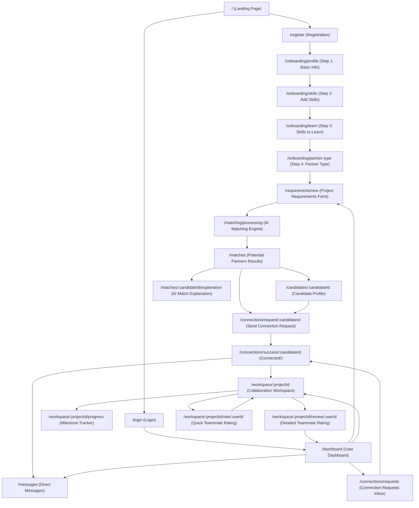

# Stitch Design System & Screen Inventory Analysis: PartnerFinder AI

> **SINGLE SOURCE OF TRUTH DIRECTIVE:**  
> The Google Stitch design specification (`syntropic_enterprise/DESIGN.md`) and the 22 exported Stitch screen bundles located in `stitch_reference/stitch_partnerfinder_ui_prompts/` constitute the absolute visual and architectural single source of truth for PartnerFinder AI.  
> No redesign, modernization, palette alternation, border-radius adjustment, shadow re-computation, typography drift, or layout restructuring is permitted. Antigravity serves as the high-fidelity implementation engine to realize this exact visual specification.

---

## Executive Summary & Design System Foundation

PartnerFinder AI is an algorithmic matchmaking and collaboration platform built for students, builders, and professionals seeking study partners, hackathon teams, and project co-founders. The visual design conforms strictly to the **Syntropic Enterprise** specification: a high-precision, executive SaaS aesthetic blending architectural rigor with modern enterprise productivity.

### Visual Foundations Summary
- **Base Canvas:** `#F8FAFC` (Slate 50) canvas with pure white `#FFFFFF` floating cards and containers.
- **Structural Anchors:** `#0F172A` (Slate 900) primary side navigation rail (260px fixed width, collapsible to 72px) and `#1E293B` (Slate 800) headers.
- **Dividers & Borders:** `#E2E8F0` (Slate 200) for standard containers; `#CBD5E1` (Slate 300) for input default strokes and hover states.
- **Signature Gradient Accent:** `linear-gradient(135deg, #7C3AED 0%, #3B82F6 100%)` strictly reserved for high-intent primary conversion buttons, match triggers, and completion steps.
- **Accent Tokens:** `#7C3AED` (Accent Purple) for match percentages, active tab indicators, and focused rings; `#3B82F6` (Accent Blue) for interactive links and data visualization pathways.
- **Semantic Tones:**
  - **Success / Match:** `#10B981` (primary), `#22C55E` (secondary tint), `#ECFDF5` (badge background).
  - **Destructive / Reject:** `#EF4444`, `#FEF2F2` (badge background), `#FCA5A5` (border).
  - **Skill / Attribute Badges:** `#E0F2FE` background, `#BAE6FD` border, `#0284C7` typography and icons.
  - **Warning / Pending:** `#F59E0B`, `#FFFBEB` background.
- **Typography Scale (Inter & JetBrains Mono):**
  - `display-lg`: Inter 32px / 40px line-height, bold 700, letter-spacing -0.025em.
  - `headline-lg`: Inter 24px / 32px line-height, semibold 600, letter-spacing -0.02em.
  - `headline-md`: Inter 20px / 28px line-height, semibold 600, letter-spacing -0.015em.
  - `headline-sm`: Inter 16px / 24px line-height, semibold 600, letter-spacing -0.01em.
  - `body-lg`: Inter 16px / 24px line-height, regular 400.
  - `body-md`: Inter 14px / 20px line-height, regular 400.
  - `body-sm`: Inter 12px / 16px line-height, regular 400.
  - `label-md`: Inter 14px / 20px line-height, medium 500.
  - `label-sm`: Inter 12px / 16px line-height, medium 500, letter-spacing 0.01em.
  - `label-xs`: Inter 11px / 14px line-height, semibold 600, letter-spacing 0.02em.
  - `code-sm`: JetBrains Mono 12px / 16px line-height, regular 400.
- **Synchronized Corner Radii:**
  - Standard cards and primary modules: `12px` (`0.75rem` / `rounded-xl`).
  - Inputs, selects, and action buttons: `8px` (`0.5rem` / `rounded-lg`).
  - Modal dialogues and elevated overlays: `16px` (`1rem` / `rounded-2xl`).
  - Badges, pill tags, and avatar status chips: `9999px` (`rounded-full`).
- **Elevation Hierarchy:**
  - Flat (Level 0): `1px solid #E2E8F0`, no shadow.
  - Rest (Level 1): `1px solid #E2E8F0`, `box-shadow: 0 1px 3px 0 rgba(15, 23, 42, 0.05), 0 1px 2px -1px rgba(15, 23, 42, 0.03)`.
  - Elevated Hover (Level 2): `1px solid #CBD5E1`, `box-shadow: 0 4px 6px -1px rgba(15, 23, 42, 0.07), 0 2px 4px -2px rgba(15, 23, 42, 0.05)`.
  - Floating Overlays (Level 3): `1px solid #E2E8F0`, `box-shadow: 0 20px 25px -5px rgba(15, 23, 42, 0.1), 0 8px 10px -6px rgba(15, 23, 42, 0.04)`.
  - Gradient Ambient Glow (Primary Hover): `box-shadow: 0 4px 14px 0 rgba(124, 58, 237, 0.35)`.

---

## A. Screen Inventory

This section details all 21 distinct functional screens represented across the 22 Stitch export bundles (accounting for identical variants `landing_page_1`/`landing_page_2` and comparative variants `rating_system_1`/`rating_system_2`). Each screen is comprehensively analyzed across all 21 mandatory criteria.

```
Total Stitch Screen Bundles: 22
Total Unique Functional Screens: 21
Coverage: 100% of all files, layouts, and components in stitch_partnerfinder_ui_prompts
```

---

### Screen 1: Landing Page
- **Stitch Folders:** `partnerfinder_ai_landing_page_1`, `partnerfinder_ai_landing_page_2`
- **1. Screen Name:** PartnerFinder AI Marketing Landing Page
- **2. URL / Route:** `/`
- **3. Layout Structure:** Public single-page marketing layout consisting of a fixed top sticky navigation bar (h-16), a fluid hero section with dual CTAs, partner type categories grid (5 cards), 4-step "How it works" sequence, popular skills cloud, recently joined users carousel/grid, testimonials/success stories cards, metrics banner, and a comprehensive 4-column footer.
- **4. Header:**
  - Left: Logo icon (`hub` symbol, primary-container violet) with text "PartnerFinder AI" (headline-sm, font-bold).
  - Center: Nav anchor links ("Home" -> `#home`, "How It Works" -> `#how-it-works`, "Success Stories" -> `#success-stories`).
  - Right: "Login" button (text/secondary button style) and "Register" button (primary gradient, rounded-lg, h-10).
- **5. Sidebar / Navigation:** None (Public marketing layout).
- **6. Cards:**
  - *Partner Category Cards (5):* Study Partner (`menu_book`), Project Partner (`rocket_launch`), Hackathon Team (`emoji_events`), Skill Exchange (`swap_horiz`), Startup Partner (`lightbulb`). Each card has `rounded-xl`, `border border-[#E2E8F0]`, background `#FFFFFF`, hover shadow and icon badge.
  - *How It Works Steps (4):* Step 1 Create Profile (`badge`), Step 2 Find Partners (`person_search`), Step 3 Connect & Collaborate (`handshake`), Step 4 Grow Together (`trending_up`).
  - *Success Stories (3):* Testimonial cards featuring quote (`format_quote`), avatar, student name, university, and partner match result.
- **7. Buttons:**
  - "Login" (outline/ghost, redirects to `/login`)
  - "Register" (primary gradient, redirects to `/register`)
  - "Find a Partner" (Hero primary CTA, gradient with `arrow_forward` icon, redirects to `/register` or `/onboarding/partner-type`)
  - "Watch Video" (Hero secondary CTA, white button with border `#E2E8F0`, `play_circle` icon)
- **8. Inputs:** None on landing view (search pill link triggers partner query).
- **9. Icons (Material Symbols Outlined):** `hub`, `arrow_forward`, `play_circle`, `school`, `code`, `emoji_events`, `swap_horiz`, `rocket_launch`, `badge`, `person_search`, `handshake`, `trending_up`, `group`, `format_quote`.
- **10. Typography:**
  - Hero Display: `text-display-lg` / `text-4xl` font-bold text-on-surface with gradient text span ("build and grow").
  - Section Headings: `headline-lg` / `headline-md` font-semibold.
  - Card titles: `headline-sm` font-semibold.
  - Body copy: `body-md` / `body-lg` text-on-surface-variant.
- **11. Colors:**
  - Background: `#F8FAFC`
  - Cards: `#FFFFFF`, borders `#E2E8F0`
  - Primary kinetic gradient: `linear-gradient(135deg, #7C3AED 0%, #3B82F6 100%)`
  - Category icon backgrounds: `#eff4ff`, `#f8f9ff`
- **12. Spacing:** Container max-w-7xl (1280px), section vertical padding `py-16` / `py-24`, gap-6 between cards.
- **13. Responsive Behavior:**
  - Desktop (1024px+): Horizontal nav links visible, 5-column category grid, 4-column steps grid, 3-column testimonials.
  - Tablet (768px - 1023px): Category grid wraps to 3 + 2, steps grid to 2x2.
  - Mobile (<768px): Header links collapse to mobile hamburger; hero buttons stack vertically; grids collapse to 1 column.
- **14. Modals:** Video player modal overlay triggered by "Watch Video" button.
- **15. Tabs:** None.
- **16. Dropdowns:** None.
- **17. Empty States:** Not applicable (static marketing content).
- **18. Loading States:** Video iframe placeholder skeleton.
- **19. Error States:** None.
- **20. All Clickable Elements:**
  - Logo -> `/`
  - Nav Link "Home" -> `#home`
  - Nav Link "How It Works" -> `#how-it-works`
  - Nav Link "Success Stories" -> `#success-stories`
  - Header Button "Login" -> `/login`
  - Header Button "Register" -> `/register`
  - Hero Button "Find a Partner" -> `/register`
  - Hero Button "Watch Video" -> Video Modal
  - Category Cards (5) -> `/register?type={category}`
  - Footer Links ("Privacy Policy", "Terms of Service", "Security", "Help Center") -> respective legal pages.
- **21. Destination of Every Clickable Element:** Explicitly mapped in item 20 above.

---

### Screen 2: User Registration
- **Stitch Folder:** `partnerfinder_ai_registration_page`
- **1. Screen Name:** User Registration / Account Creation
- **2. URL / Route:** `/register`
- **3. Layout Structure:** Centered single-column auth card layout on a full-height `#F8FAFC` canvas. The card is fixed max-w-[480px], centered horizontally and vertically, framed with `#E2E8F0` border and Level 1 drop shadow.
- **4. Header:** Compact brand header centered at top of auth card featuring the `hub` logo icon and "PartnerFinder AI" wordmark.
- **5. Sidebar / Navigation:** None.
- **6. Cards:**
  - *Main Registration Card:* `bg-surface-container-lowest` (`#FFFFFF`), `p-8`, `rounded-[16px]`, `border border-[#E2E8F0]`, `shadow-sm`.
- **7. Buttons:**
  - Password visibility toggle 1 (`visibility` icon button inside password field)
  - Password visibility toggle 2 (`visibility` icon button inside confirm password field)
  - "Create Account" (full-width primary gradient button, h-[46px], `rounded-[10px]`, text-white font-label-md)
  - Social buttons (optional Google / Microsoft SSO buttons styled with Level 1 borders)
- **8. Inputs (4):**
  - Full Name: `input[type="text"]`, placeholder "John Doe", with left-aligned `person` icon.
  - Email Address: `input[type="email"]`, placeholder "name@company.com", with left-aligned `mail` icon.
  - Password: `input[type="password"]`, placeholder "••••••••", with left-aligned `lock` icon and right-aligned `visibility` toggle.
  - Confirm Password: `input[type="password"]`, placeholder "••••••••", with left-aligned `lock` icon and right-aligned `visibility` toggle.
  - Terms Agreement: `input[type="checkbox"]` with label "I agree to the Terms of Service and Privacy Policy".
- **9. Icons (Material Symbols Outlined):** `hub`, `person`, `mail`, `lock`, `visibility`.
- **10. Typography:**
  - Card Title: `h1` "Create Your Account" (`headline-lg` 24px/32px font-bold text-on-surface).
  - Subtitle: `body-sm` text-on-surface-variant ("Join thousands of builders finding their ideal project partners").
  - Form Labels: `label-sm` font-medium text-on-surface.
  - Input Text: `body-md` 14px.
  - Button Text: `label-md` 14px font-medium.
- **11. Colors:**
  - Canvas: `#F8FAFC`
  - Card: `#FFFFFF`
  - Input Border: `#E2E8F0`, Input Focus Border: `#7C3AED` with ring `rgba(124, 58, 237, 0.15)`
  - CTA Button: `linear-gradient(135deg, #7C3AED 0%, #3B82F6 100%)`
- **12. Spacing:** Card padding `p-8` (32px), field gap `gap-4` (16px), submit button margin-top `mt-6` (24px).
- **13. Responsive Behavior:** Mobile (<640px): Card fills viewport width (`w-full`), outer margin reduces to `p-4`, border-radius adjusts to `12px`.
- **14. Modals:** None.
- **15. Tabs:** None.
- **16. Dropdowns:** None.
- **17. Empty States:** None.
- **18. Loading States:** Submit button shows inline spinning circle and disabled state during registration request.
- **19. Error States:**
  - Field error outline: `border-error` (`#BA1A1A`)
  - Helper error message below field in `text-error text-label-xs`
  - Top alert banner for server validation errors (`bg-[#FEF2F2] border border-[#FCA5A5] text-[#EF4444]`)
- **20. All Clickable Elements:**
  - Logo icon -> `/`
  - Toggle Password Visibility 1 -> toggles password/text type
  - Toggle Password Visibility 2 -> toggles password/text type
  - Checkbox "I agree to Terms" -> toggles boolean state
  - "Terms of Service" link -> `/terms`
  - "Privacy Policy" link -> `/privacy`
  - "Create Account" button -> Submits form -> navigates to `/onboarding/profile`
  - "Already have an account? Login" link -> `/login`
- **21. Destination of Every Clickable Element:** Mapped in item 20.

---

### Screen 3: User Login
- **Stitch Folder:** `partnerfinder_ai_login_page`
- **1. Screen Name:** User Authentication / Login
- **2. URL / Route:** `/login`
- **3. Layout Structure:** Centered auth card on full-height `#F8FAFC` background. Structured with brand header, welcome typography, credential inputs, remember/forgot password row, primary login action, divider line with "Or continue with", and enterprise social OAuth buttons.
- **4. Header:** Centered logo (`hub` in primary-container) and text "PartnerFinder AI".
- **5. Sidebar / Navigation:** None.
- **6. Cards:**
  - *Main Login Card:* Max-w-[440px], `#FFFFFF`, `rounded-2xl`, `border border-[#E2E8F0]`, `p-8`, `shadow-sm`.
- **7. Buttons:**
  - Visibility toggle (`visibility` icon button)
  - "Login" (full-width primary gradient button, h-11, `rounded-lg`)
  - "Continue with Google" (secondary neutral button with Google icon, border `#E2E8F0`, h-11, text-on-surface)
  - "Continue with Microsoft" (secondary neutral button with Microsoft icon, border `#E2E8F0`, h-11, text-on-surface)
- **8. Inputs (3):**
  - Email Address: `input[type="email"]`, placeholder "name@company.com", left icon `mail`.
  - Password: `input[type="password"]`, placeholder "••••••••", left icon `lock`, right icon `visibility`.
  - Remember Me: `input[type="checkbox"]` with label "Remember for 30 days".
- **9. Icons (Material Symbols Outlined):** `hub`, `mail`, `lock`, `visibility`.
- **10. Typography:**
  - H1: "Welcome Back" (`headline-lg` 24px/32px font-bold).
  - Subtitle: "Sign in to your account to continue" (`body-sm` text-on-surface-variant).
  - Form labels: `label-sm` font-medium.
  - Forgot password: `label-sm` text-primary font-medium.
- **11. Colors:**
  - Background: `#F8FAFC`
  - Card: `#FFFFFF`, border `#E2E8F0`
  - Button: `linear-gradient(135deg, #7C3AED 0%, #3B82F6 100%)`
  - Social buttons hover: `#F8FAFC`, border `#CBD5E1`
- **12. Spacing:** Card max-w-md, padding `p-8`, element spacing `space-y-4`.
- **13. Responsive Behavior:** Mobile (<480px): Card becomes edge-to-edge with `px-4 py-6`, shadow removed.
- **14. Modals:** "Forgot Password" modal dialog (email reset trigger).
- **15. Tabs:** None.
- **16. Dropdowns:** None.
- **17. Empty States:** None.
- **18. Loading States:** "Login" button transitions to spinner state with disabled opacity (0.7).
- **19. Error States:** Invalid credentials trigger an inline error toast or banner: "Invalid email or password combination."
- **20. All Clickable Elements:**
  - Logo -> `/`
  - Password visibility toggle -> toggles input type
  - "Remember for 30 days" checkbox -> toggles checked state
  - "Forgot Password?" link -> opens reset modal or navigates to `/forgot-password`
  - "Login" button -> Submits form -> redirects to `/dashboard`
  - "Continue with Google" -> triggers OAuth Google flow
  - "Continue with Microsoft" -> triggers OAuth Microsoft flow
  - "Create Account" link -> `/register`
- **21. Destination of Every Clickable Element:** Mapped in item 20.

---

### Screen 4: Onboarding - Create Profile
- **Stitch Folder:** `partnerfinder_ai_create_profile`
- **1. Screen Name:** Onboarding Step 1: Basic Information
- **2. URL / Route:** `/onboarding/profile`
- **3. Layout Structure:** Global Top Command Bar (h-16), Step Progress Tracker at top (Step 1 of 4: "Basic Information"), centered form card container (max-w-[720px]), and bottom global footer.
- **4. Header:**
  - Global navbar with Logo (`hub`), navigation items ("Home", "How It Works", "Success Stories"), and authenticated profile or "Register" state.
- **5. Sidebar / Navigation:** None (Multi-step onboarding flow).
- **6. Cards:**
  - *Profile Form Container Card:* White `#FFFFFF`, `rounded-xl`, `border border-[#E2E8F0]`, `p-8`, `shadow-sm`.
  - *Avatar Upload Section:* Circular photo placeholder (w-24 h-24) with border and "Change Photo" button.
- **7. Buttons:**
  - "Register" (header action)
  - "Change Photo" (secondary button, h-9, px-3, border `#E2E8F0`, rounded-lg, text-body-sm)
  - "Next" (primary gradient action, h-11, px-8, rounded-lg, text-white font-label-md)
- **8. Inputs (6):**
  - Full Name: `input[type="text"]`, placeholder "e.g. Alex Morgan"
  - University / Institution: `input[type="text"]`, placeholder "e.g. Stanford University"
  - Major / Degree: `input[type="text"]`, placeholder "e.g. Computer Science"
  - Year of Study: `input[type="text"]`, placeholder "e.g. Junior (Year 3)"
  - Location: `input[type="text"]`, placeholder "e.g. San Francisco, CA"
  - Bio / About: `textarea`, placeholder "Provide a brief summary of your background, technical focus, and collaboration goals..." (rows=4)
- **9. Icons (Material Symbols Outlined):** `hub`, `person`, `photo_camera`.
- **10. Typography:**
  - Step Title: `h1` "Basic Information" (`headline-lg` 24px/32px font-bold).
  - Field Labels: `label-sm` font-medium text-on-surface.
  - Inputs: `body-md` 14px text-on-surface.
  - Helper notes: `body-sm` text-on-surface-variant.
- **11. Colors:**
  - Canvas: `#F8FAFC`
  - Form container: `#FFFFFF`
  - Active step indicator: `#7C3AED`
  - Next Button: `linear-gradient(135deg, #7C3AED 0%, #3B82F6 100%)`
- **12. Spacing:** Max-width 720px, card padding `p-8`, 2-column grid for university/major and year/location (`gap-4`), vertical form spacing `space-y-5`.
- **13. Responsive Behavior:** Mobile: 2-column input rows collapse to single column; card padding reduces to `p-5`.
- **14. Modals:** File picker modal when "Change Photo" is pressed.
- **15. Tabs:** Multi-step horizontal progress bar (Step 1 Basic Info -> Step 2 Add Skills -> Step 3 Skills to Learn -> Step 4 Partner Type).
- **16. Dropdowns:** Year of Study can optionally provide preset select options.
- **17. Empty States:** Avatar displays default silhouette icon (`person`) until photo is selected.
- **18. Loading States:** Avatar image upload progress indicator.
- **19. Error States:** Required fields (Full Name, University, Major) highlighted with red border `#EF4444` if submitted empty.
- **20. All Clickable Elements:**
  - Logo -> `/`
  - Top Nav Links -> `#home`, `#how-it-works`, `#success-stories`
  - "Change Photo" button -> native file input / picker
  - "Next" button -> validates inputs -> navigates to `/onboarding/skills`
  - Footer Links -> legal pages
- **21. Destination of Every Clickable Element:** Mapped in item 20.

---

### Screen 5: Onboarding - Add Your Skills
- **Stitch Folder:** `partnerfinder_ai_add_skills`
- **1. Screen Name:** Onboarding Step 2: Add Your Skills
- **2. URL / Route:** `/onboarding/skills`
- **3. Layout Structure:** Top command bar header, step progress bar (Step 2 of 4), main content card container (max-w-[760px]) featuring search input, popular skills tag cloud, selected skills table/list with proficiency level selectors, custom skill addition input, and bottom step navigation buttons (Back, Next).
- **4. Header:** Top navbar with Logo (`hub`), navigation links, Login, Register.
- **5. Sidebar / Navigation:** None (Onboarding flow).
- **6. Cards:**
  - *Skills Configuration Card:* `#FFFFFF`, `rounded-xl`, `border border-[#E2E8F0]`, `p-8`, `shadow-sm`.
  - *Selected Skill Row Cards:* Individual skill rows with skill name, proficiency dropdown (`Beginner`, `Intermediate`, `Advanced`, `Expert`), and `delete` icon button.
- **7. Buttons (16):**
  - "Login", "Register"
  - Popular Skill Chips: "C# check", "Angular check", "SQL check", "HTML check", "CSS check" (Selected state: `bg-primary-container text-white`)
  - Popular Skill Chips: "Python", "Machine Learning", "UI/UX" (Unselected state: `bg-surface-container-low text-on-surface hover:bg-surface-container`)
  - Delete skill buttons (`delete` trash icon per selected row)
  - "+ Add Custom Skill" button (`add` icon, outline style)
  - "Back" button (secondary neutral, border `#E2E8F0`, redirects to `/onboarding/profile`)
  - "Next" button (primary gradient, redirects to `/onboarding/learn`)
- **8. Inputs (4):**
  - Search skills: `input[type="text"]`, placeholder "Search skills...", left icon `search`.
  - Proficiency selects (3 visible in default state): `select` containing options `Beginner`, `Intermediate`, `Advanced`, `Expert`.
- **9. Icons (Material Symbols Outlined):** `hub`, `check`, `delete`, `add`, `search`.
- **10. Typography:**
  - Title: `h1` "Add Your Skills" (`headline-lg` 24px/32px font-bold).
  - Subheaders: `h2` "Popular Skills", `h2` "Selected Skills" (`headline-sm` font-semibold text-on-surface).
  - Skill pills: `label-sm` font-medium.
  - Dropdown text: `body-md` 14px.
- **11. Colors:**
  - Selected Skill Pills: `#7C3AED` background, `#FFFFFF` text.
  - Unselected Skill Pills: `#EFF4FF` background, `#0B1C30` text, border `#DCE9FF`.
  - Delete icon: text-on-surface-variant hover:text-error (`#EF4444`).
- **12. Spacing:** Container max-w-[760px], `gap-2` between skill pills, `space-y-6` between sections, button footer `pt-6 border-t border-[#E2E8F0]`.
- **13. Responsive Behavior:** Mobile: Selected skill rows stack skill name, level dropdown, and delete icon across full width; action buttons expand to 50/50 flex layout.
- **14. Modals:** "Add Custom Skill" popup or inline input reveal.
- **15. Tabs:** None.
- **16. Dropdowns:** Proficiency selector for each selected skill.
- **17. Empty States:** "No skills selected yet. Click popular skills above or search to add skills you possess."
- **18. Loading States:** Autocomplete debounce spinner inside search field.
- **19. Error States:** Attempting to proceed with 0 selected skills displays inline warning banner: "Please add at least one skill to continue."
- **20. All Clickable Elements:**
  - Logo -> `/`
  - Popular skill chips (8) -> toggles skill selection
  - Skill search bar -> focuses and filters chips
  - Proficiency selects -> updates level value
  - Delete icons -> removes skill from selected list
  - "+ Add Custom Skill" -> adds custom skill to list
  - "Back" -> `/onboarding/profile`
  - "Next" -> `/onboarding/learn`
- **21. Destination of Every Clickable Element:** Mapped in item 20.

---

### Screen 6: Onboarding - Skills You Want to Learn
- **Stitch Folder:** `partnerfinder_ai_skills_to_learn`
- **1. Screen Name:** Onboarding Step 3: Skills You Want to Learn
- **2. URL / Route:** `/onboarding/learn`
- **3. Layout Structure:** Consistent onboarding card layout (max-w-[760px]) with top header, step tracker (Step 3 of 4), skill search bar, pre-selected target learning skills with priority and remove buttons, categorical exploratory pills, and navigation footer (Back, Next).
- **4. Header:** Top navbar with Logo (`hub`), navigation links, Login, Register.
- **5. Sidebar / Navigation:** None.
- **6. Cards:**
  - *Main Card:* `#FFFFFF`, `rounded-xl`, `border border-[#E2E8F0]`, `p-8`, `shadow-sm`.
  - *Selected Learning Cards:* List items with category icon (`terminal`, `psychology`, `smartphone`), skill title, and delete icon.
- **7. Buttons (15):**
  - "Login", "Register"
  - Selected Learning Skill Tags: "check Python", "check Machine Learning", "check Flutter"
  - Suggested Skill Chips: "AI", "Data Science", "UI/UX", "DevOps", "Mobile Development"
  - Delete buttons (`delete` icon)
  - "Back" (secondary, redirects to `/onboarding/skills`)
  - "Next" (primary gradient, redirects to `/onboarding/partner-type`)
- **8. Inputs (1):**
  - Search skills: `input[type="text"]`, placeholder "Search skills...", left icon `search`.
- **9. Icons (Material Symbols Outlined):** `hub`, `check`, `help_outline`, `search`, `terminal`, `delete`, `psychology`, `smartphone`.
- **10. Typography:**
  - Title: `h1` "Skills You Want to Learn" (`headline-lg` 24px/32px font-bold).
  - Subtitle: "Tell us what technologies, frameworks, or domains you want to learn from your partner."
  - Skill labels: `label-sm` font-medium.
- **11. Colors:**
  - Active learning chips: `#E0F2FE` (Informative badge background), border `#BAE6FD`, text `#0284C7`.
  - Delete icon: `#7B7487` hover `#EF4444`.
- **12. Spacing:** Max-w-[760px], `space-y-6`, `gap-2` for suggested skill chips, row gap `gap-3`.
- **13. Responsive Behavior:** Mobile: Suggested chips wrap smoothly with `gap-1.5`; navigation buttons arrange side-by-side or stack.
- **14. Modals:** None.
- **15. Tabs:** None.
- **16. Dropdowns:** None.
- **17. Empty States:** Empty selected container: "No learning interests added yet. Select from suggestions below."
- **18. Loading States:** Search autocomplete loading state.
- **19. Error States:** Inline notice if 0 skills added: "Add at least one skill or topic you want to explore."
- **20. All Clickable Elements:**
  - Logo -> `/`
  - Suggested chips (5) -> toggles inclusion in learning list
  - Delete icons -> removes skill from list
  - "Back" -> `/onboarding/skills`
  - "Next" -> `/onboarding/partner-type`
- **21. Destination of Every Clickable Element:** Mapped in item 20.

---

### Screen 7: Onboarding - Choose Partner Type
- **Stitch Folder:** `partnerfinder_ai_choose_partner_type`
- **1. Screen Name:** Onboarding Step 4: Choose Partner Type
- **2. URL / Route:** `/onboarding/partner-type`
- **3. Layout Structure:** Centered container (max-w-[960px]) with top header, step tracker (Step 4 of 4), header title and description, 5 large selectable interactive partner category cards presented in a responsive grid, and navigation action footer (Back, Next).
- **4. Header:** Top navbar with Logo (`hub`), links ("Home", "How It Works", "Success Stories"), and Login/Register.
- **5. Sidebar / Navigation:** None.
- **6. Cards:**
  - *5 Partner Type Selectable Cards:*
    1. **Study Partner:** Icon `menu_book`, title "Study Partner", description "Pair up to study course material, prepare for exams, or tackle difficult academic assignments together."
    2. **Project Partner:** Icon `rocket_launch`, title "Project Partner", description "Collaborate on building a software project, MVP, portfolio application, or semester milestone."
    3. **Hackathon Team:** Icon `emoji_events`, title "Hackathon Team", description "Form a competitive, well-rounded team with complementary skills to enter hackathons."
    4. **Skill Exchange:** Icon `swap_horiz`, title "Skill Exchange", description "Teach what you know and learn what you don't in a reciprocal peer mentorship exchange."
    5. **Startup Partner:** Icon `lightbulb`, title "Startup Partner", description "Find a technical co-founder or early collaborator to validate and build a startup venture."
  - *Card Styling:* `#FFFFFF`, `rounded-xl`, `p-6`, `border border-[#E2E8F0]`, hover `border-[#7C3AED] hover:shadow-md`, active radio indicator or checkmark icon `check`.
- **7. Buttons (4):**
  - "Login", "Register"
  - "Back" (secondary button, border `#E2E8F0`, redirects to `/onboarding/learn`)
  - "Next" (primary gradient button, redirects to `/requirements/new` for Project Partner or `/matching/processing`)
- **8. Inputs (0):** Radio card selection mechanism with accessible `role="radio"`.
- **9. Icons (Material Symbols Outlined):** `hub`, `menu_book`, `rocket_launch`, `emoji_events`, `swap_horiz`, `lightbulb`, `check`.
- **10. Typography:**
  - Title: `h1` "Choose Partner Type" (`headline-lg` 24px/32px font-bold text-on-surface).
  - Subtitle: `body-md` text-on-surface-variant ("Select the primary collaboration mode you are seeking").
  - Card Titles: `h2` (`headline-sm` 16px/24px font-semibold).
  - Card Descriptions: `body-sm` 12px/16px text-on-surface-variant.
- **11. Colors:**
  - Selected Card: Border `#7C3AED`, background `rgba(124, 58, 237, 0.03)` or `#F8F9FF`, check badge in `#7C3AED`.
  - Unselected Card: Border `#E2E8F0`, background `#FFFFFF`.
- **12. Spacing:** 3-column top row, 2-column bottom row (or responsive 3-column grid), card padding `p-6`, gap `gap-5`.
- **13. Responsive Behavior:** Desktop (1024px+): 3 + 2 grid; Tablet (768px): 2-column grid; Mobile (<768px): 1-column vertical stack.
- **14. Modals:** None.
- **15. Tabs:** None.
- **16. Dropdowns:** None.
- **17. Empty States:** None (one card selected by default).
- **18. Loading States:** Proceed button loading spinner.
- **19. Error States:** Proceeding without selection triggers prompt outline.
- **20. All Clickable Elements:**
  - Logo -> `/`
  - Partner Category Cards (5) -> selects partner type
  - "Back" -> `/onboarding/learn`
  - "Next" -> `/requirements/new` (or direct to `/matching/processing`)
- **21. Destination of Every Clickable Element:** Mapped in item 20.

---

### Screen 8: Project Partner Requirements Form
- **Stitch Folder:** `partnerfinder_ai_partner_requirement_form`
- **1. Screen Name:** Project Partner Requirements Form
- **2. URL / Route:** `/requirements/new`
- **3. Layout Structure:** Top command bar header, centered form card container (max-w-[800px]) on `#F8FAFC` background. Structured into project headline, role definition, experience level selection, required skills tag manager, weekly time commitment, day-of-week interactive availability selectors (Mon-Sun), project duration dropdown, location preferences, detailed project scope description textarea, and sticky bottom action bar (Back, Find Partners).
- **4. Header:** Top navbar with Logo (`hub`), navigation items ("Home", "How It Works", "Success Stories"), and Login/Register links.
- **5. Sidebar / Navigation:** None.
- **6. Cards:**
  - *Main Form Card:* `#FFFFFF`, `rounded-xl`, `border border-[#E2E8F0]`, `p-8`, `shadow-sm`.
  - *Skill Chips Container:* Elevated flexbox container displaying active requirement tags with dismiss buttons.
- **7. Buttons (12):**
  - "Login", "Register"
  - Skill tag remove buttons (`close` icon per skill badge: e.g. Python, AI, React)
  - Availability Day Toggle Buttons (7): "Mon", "Tue", "Wed", "Thu", "Fri", "Sat", "Sun" (Multi-select toggle pills; active state: `bg-primary-container text-white`, inactive state: `bg-surface-container-low text-on-surface hover:bg-surface-container border border-[#E2E8F0]`)
  - "Back" button (secondary neutral, border `#E2E8F0`, redirects to `/onboarding/partner-type`)
  - "Find Partners" button (high-prominence primary gradient button with `spark` / `auto_awesome` icon, redirects to `/matching/processing`)
- **8. Inputs (7):**
  - Project Headline: `input[type="text"]`, placeholder "Enter project headline" (e.g. "AI Event Assistant - Intelligent Matchmaker")
  - Weekly Hours Commitment: `input[type="number"]`, placeholder "e.g. 15", min="1", max="60", unit "hrs/week"
  - Required Experience Level: `select` with options:
    - "Entry Level (0 - 1 year)"
    - "Intermediate (2 - 4 years)"
    - "Senior (5+ years)"
    - "Lead / Architect"
  - Skill Input / Autocomplete: `input[type="text"]` with "+ Add Skill" trigger
  - Location Preference: `input[type="text"]` (or select: "Remote", "Hybrid", "On-site")
  - Project Duration: `select` with options:
    - "2 Weeks (Sprint MVP)"
    - "4 Weeks (Prototype)"
    - "6 Weeks (Full V1 Build)"
    - "3 Months (Production Scale)"
  - Project Description / Scope: `textarea` (rows=4, placeholder "Describe the project goals, architecture, and what you expect from your ideal collaborator...")
- **9. Icons (Material Symbols Outlined):** `hub`, `auto_awesome`, `edit`, `close`, `add`, `group`, `expand_more`, `schedule`, `location_on`, `calendar_today`, `arrow_back`, `spark`.
- **10. Typography:**
  - Title: `h1` "Project Partner Requirements" (`headline-lg` 24px/32px font-bold text-on-surface).
  - Section Labels: `label-sm` font-medium text-on-surface.
  - Form Inputs: `body-md` 14px.
  - Day toggle text: `label-xs` font-semibold.
- **11. Colors:**
  - Card: `#FFFFFF`, border `#E2E8F0`
  - Active Day Pills: `#7C3AED` background, `#FFFFFF` text
  - Primary Action: `linear-gradient(135deg, #7C3AED 0%, #3B82F6 100%)`
  - Tag pill badges: `#E0F2FE` background, `#0284C7` text
- **12. Spacing:** Max-w-[800px], card padding `p-8`, 2-column input rows (`gap-5`), vertical field separation `space-y-5`, day toggle group `gap-2`.
- **13. Responsive Behavior:** Mobile: 2-column inputs collapse to 1 column; day-of-week buttons shrink to circular or compact pill buttons; action footer stacks.
- **14. Modals:** None.
- **15. Tabs:** None.
- **16. Dropdowns:** Experience level select, Duration select.
- **17. Empty States:** Skills container has helper text "Add key technologies or libraries needed for this project."
- **18. Loading States:** "Find Partners" button enters spinner state upon submission before transition.
- **19. Error States:** Incomplete required fields (headline, skills, weekly commitment) outlined in `#EF4444`.
- **20. All Clickable Elements:**
  - Logo -> `/`
  - Tag close buttons -> removes skill tag
  - "+ Add Skill" -> adds custom requirement chip
  - Day toggle pills (7) -> toggles active boolean for that day
  - "Back" button -> `/onboarding/partner-type`
  - "Find Partners" button -> validates form -> routes to `/matching/processing`
- **21. Destination of Every Clickable Element:** Mapped in item 20.

---

### Screen 9: AI Matching Processing / Loading State
- **Stitch Folder:** `partnerfinder_ai_matching_processing`
- **1. Screen Name:** AI Matching Algorithmic Processing
- **2. URL / Route:** `/matching/processing`
- **3. Layout Structure:** Clean centered progress canvas (max-w-[640px]) on `#F8FAFC` background with top command bar header and global footer. Centered card features an animated pulsing AI robot/vector icon (`smart_toy`), animated radial gradient pulse ring, title, subtitle, a 5-step checklist representing algorithmic matching phases, and an active percentage progress bar with status confirmation banner.
- **4. Header:** Top navbar with Logo (`hub`), links ("Home", "How It Works", "Success Stories"), and Login/Register.
- **5. Sidebar / Navigation:** None.
- **6. Cards:**
  - *Central Processing Card:* `#FFFFFF`, `rounded-2xl`, `border border-[#E2E8F0]`, `p-10`, `shadow-sm`, text-center.
  - *Progress Checklist Container:* `bg-surface-container-low` (`#EFF4FF`), `p-5`, `rounded-xl`, `border border-[#DCE9FF]`.
- **7. Buttons (2):**
  - "Login", "Register" (header actions)
  - (No explicit manual buttons in processing state; screen transitions automatically or via "View Results Now" fallback button).
- **8. Inputs (0):** None.
- **9. Icons (Material Symbols Outlined):** `hub`, `smart_toy`, `check_circle`, `verified`.
- **10. Typography:**
  - Processing Heading: `h1` "Finding the best partners for you..." (`headline-lg` 24px/32px font-bold text-on-surface).
  - Subtitle: `body-md` text-on-surface-variant ("Our AI is analyzing your requirements and finding the most suitable people").
  - Step items: `label-md` 14px font-medium.
  - Percentage: `display-lg` / `headline-md` font-bold text-primary.
- **11. Colors:**
  - Background: `#F8FAFC`
  - Central icon container: `bg-primary-fixed` (`#EADDFF`), icon color `#630ED4`
  - Completed check icons: `#10B981` (emerald-500)
  - Progress bar track: `#E5EEFF`, fill: `linear-gradient(135deg, #7C3AED 0%, #3B82F6 100%)`
  - Success banner: `bg-[#ECFDF5] border border-[#A7F3D0] text-[#065F46]`
- **12. Spacing:** Max-w-[640px], card padding `p-10`, vertical item spacing `space-y-6`, checklist item gap `py-2`.
- **13. Responsive Behavior:** Mobile: Container padding `p-5`, icon size scales down from 64px to 48px, typography wraps cleanly.
- **14. Modals:** None.
- **15. Tabs:** None.
- **16. Dropdowns:** None.
- **17. Empty States:** None.
- **18. Loading States:**
  - Rotating / pulsing keyframe animation on `smart_toy` icon.
  - Sequential step completion:
    1. "Checking skills" -> `check_circle` (Completed)
    2. "Checking interests" -> `check_circle` (Completed)
    3. "Checking availability" -> `check_circle` (Completed)
    4. "Checking project requirements" -> `check_circle` (Completed)
    5. "Calculating compatibility" -> `check_circle` (Completed)
  - Animated progress bar from 0% to 100% over simulated 2.5 - 3.5 seconds.
  - Confirmation pill reveal: `verified` "We found 8 potential partners! Preparing your results...".
- **19. Error States:** Timeout or connection interruption displays retry button: "Matching took longer than expected. Click to retry."
- **20. All Clickable Elements:**
  - Logo -> `/`
  - Automatic transition trigger (upon progress completion) -> navigates to `/matches`
- **21. Destination of Every Clickable Element:** Transitions to `/matches`.

---

### Screen 10: Potential Partners / Matching Results
- **Stitch Folder:** `partnerfinder_ai_matching_results`
- **1. Screen Name:** Potential Partners / Matching Results
- **2. URL / Route:** `/matches`
- **3. Layout Structure:** Top command bar header, sticky project context banner ("Project: AI Event Assistant • Matched 8 candidates"), filter & sorting toolbar, 2-column or 3-column responsive partner card grid, and bottom "Load More Matches" pagination bar.
- **4. Header:** Top navbar with Logo (`hub`), navigation links, Login, Register.
- **5. Sidebar / Navigation:** Optional side rail or full-width container (max-w-[1240px]).
- **6. Cards:**
  - *Context Header Card:* Background `#F8FAFC`, title "Potential Partners", subtitle, and active AI engine badge ("AI Match Engine v4.2 Active" with `auto_awesome` icon).
  - *Candidate Result Cards:*
    - **Card 1: K.Thulaanchan**
      - Header: Avatar photo, name, badge "Available Sat & Sun", role "Full Stack AI Developer • Jaffna / Remote".
      - Match Score Badge: Circular/pill indicator "91% Match" (primary-fixed background with primary violet border).
      - Metric Breakdown: Skills: 95% • Availability: 90% • Experience: 88%.
      - Bio summary: "Passionate about building AI-driven web apps and fine-tuning LLMs. Looking to collaborate on production-ready hackathon or MVP projects."
      - Matching Tech Stack Chips: Python (`check_circle`), AI, SQL, FastAPI (`rounded-full`, `#E0F2FE`, border `#BAE6FD`, text `#0284C7`).
      - Verified Reviews: Star rating 4.9 (12 reviews) with `workspace_premium` badge.
      - Action Bar: Bookmark button (`bookmark` icon), "View Full Profile" (neutral button), "Send Connection Request" (primary gradient button with `person_add` icon).
    - **Card 2: V.Vishanan**
      - Role: UI/UX Designer & Frontend Developer.
      - Match Score: 86% Match.
      - Tech Stack: Figma, Design Systems, Tailwind CSS, Angular.
      - Actions: Bookmark, "View Full Profile", "Send Connection Request".
- **7. Buttons (13):**
  - "Login", "Register"
  - Filter Pills (3): "All (8)" [Active: `bg-primary-container text-white`], "90%+ Match (3)", "Available Weekends (5)"
  - "Refine Requirements" button (`tune` icon, secondary neutral style)
  - Bookmark buttons (`bookmark` icon button per card)
  - "View Full Profile" buttons (secondary neutral style per card)
  - "Send Connection Request" buttons (primary gradient with `person_add` icon per card)
  - "Load More Matches" button (neutral button with `keyboard_arrow_down` icon)
- **8. Inputs (1):**
  - Sort selector: `select` with options:
    - "Best Match (Highest Score)"
    - "Availability (Most Open)"
    - "Experience (Seniority)"
    - "Project Rating (High to Low)"
- **9. Icons (Material Symbols Outlined):** `hub`, `auto_awesome`, `expand_more`, `tune`, `check_circle`, `workspace_premium`, `schedule`, `star`, `bookmark`, `person_add`, `keyboard_arrow_down`.
- **10. Typography:**
  - Page Title: `h1` "Potential Partners" (`headline-lg` 24px/32px font-bold).
  - Candidate Name: `h2` (`headline-sm` 16px/24px font-semibold text-on-surface).
  - Match Score: `label-sm` font-bold text-primary.
  - Subheaders / Stats: `body-sm` 12px.
- **11. Colors:**
  - Canvas: `#F8FAFC`
  - Cards: `#FFFFFF`, borders `#E2E8F0`
  - Match Score Pill: `bg-primary-fixed` (`#EADDFF`), text `text-primary` (`#630ED4`), border `#D2BBFF`
  - Skill Pills: `#E0F2FE` background, `#0284C7` text
  - Send Request Button: `linear-gradient(135deg, #7C3AED 0%, #3B82F6 100%)`
- **12. Spacing:** Max-w-[1240px], card padding `p-6`, card grid gap `gap-6`, skill tags gap `gap-1.5`.
- **13. Responsive Behavior:** Desktop (1024px+): 2-column or 3-column card grid; Tablet: 2-column; Mobile (<768px): 1-column cards, filter toolbar scrolls horizontally.
- **14. Modals:**
  - "Refine Requirements" slide-over drawer or modal
  - "Send Connection Request" modal overlay
  - "Match Explanation" modal overlay
- **15. Tabs:** Filter tabs ("All", "90%+ Match", "Available Weekends").
- **16. Dropdowns:** "Sort by" dropdown.
- **17. Empty States:** "No candidates meet this exact filter. Try resetting filters or clicking Refine Requirements."
- **18. Loading States:** Skeleton card cards with animated shimmer when fetching or filtering.
- **19. Error States:** Error toast if sending connection request fails.
- **20. All Clickable Elements:**
  - Logo -> `/`
  - Filter pills -> filters displayed candidates
  - Sort dropdown -> sorts cards
  - "Refine Requirements" -> opens `/requirements/new` (or drawer)
  - Bookmark icon -> toggles candidate save state
  - "View Full Profile" -> `/candidates/:candidateId`
  - Match Score click -> `/matches/:candidateId/explanation`
  - "Send Connection Request" -> opens connection request modal `/connections/request/:candidateId`
  - "Load More Matches" -> loads next batch of candidates
- **21. Destination of Every Clickable Element:** Mapped in item 20.

---

### Screen 11: Candidate Profile Deep-Dive
- **Stitch Folder:** `partnerfinder_ai_candidate_profile`
- **1. Screen Name:** Candidate Profile Deep-Dive (K.Thulaanchan / Nimal Perera)
- **2. URL / Route:** `/candidates/:candidateId`
- **3. Layout Structure:** Top command bar header, sticky navigation back button ("Back" with `arrow_back` icon), hero profile header banner with avatar, name, verification badge, institution, location, action buttons (Message, Connect), multi-tab content switcher (Overview, Projects, Reviews), 2-column layout (Left: About, Skills, Projects; Right: Interests, Availability calendar/hours widget), and global footer.
- **4. Header:** Top navbar with Logo (`hub`), navigation links, Login, Register.
- **5. Sidebar / Navigation:** None.
- **6. Cards:**
  - *Profile Hero Banner Card:* `#FFFFFF`, `rounded-xl`, `border border-[#E2E8F0]`, `p-6`, `shadow-sm`.
  - *About Card:* `#FFFFFF`, `rounded-xl`, `border border-[#E2E8F0]`, `p-6`.
  - *Skills Card:* Categorized grid with skill title and proficiency level badges (e.g. Python - Advanced, AI - Intermediate, SQL - Intermediate, FastAPI - Intermediate).
  - *Previous Project Cards (2):*
    - "AI Chatbot" (Project description, stack pills, outcome)
    - "Student Management System" (Project description, stack pills, outcome)
  - *Availability Card:* Availability days (Sat & Sun), hours (15 hrs/week), timezone ("UTC+5:30 (Sri Lanka)").
  - *Interests Card:* List of interests (Artificial Intelligence, Web Development, Cloud Systems).
- **7. Buttons (7):**
  - "Login", "Register"
  - "Back" button (navigates back to `/matches`)
  - "Message" button (secondary neutral button, redirects to `/messages?user=:candidateId`)
  - "Connect" button (`person_add` icon, primary gradient button, opens connection request modal)
  - Tabs: "Overview" [Active], "Projects", "Reviews"
- **8. Inputs (0):** None.
- **9. Icons (Material Symbols Outlined):** `hub`, `arrow_back`, `school`, `person_add`, `calendar_today`, `schedule`, `location_on`, `smart_toy`, `groups`.
- **10. Typography:**
  - Candidate Name: `h1` "K.Thulaanchan" (`headline-lg` 24px/32px font-bold).
  - Section Headings: `h2` "About", "Skills", "Interests", "Availability", "Previous Projects" (`headline-sm` font-semibold).
  - Project Titles: `h3` (`headline-sm` font-semibold).
  - Meta info: `body-sm` text-on-surface-variant.
- **11. Colors:**
  - Hero Card: `#FFFFFF`, border `#E2E8F0`
  - Connect CTA: `linear-gradient(135deg, #7C3AED 0%, #3B82F6 100%)`
  - Active Tab: Border-b-2 `#7C3AED`, text `#7C3AED` font-semibold
  - Skill pills: `#E0F2FE` background, `#0284C7` text
- **12. Spacing:** Max-w-[1080px], hero padding `p-6`, 2-column grid (col-span-8 and col-span-4), gap `gap-6`.
- **13. Responsive Behavior:** Mobile: Hero actions stack; 2-column layout collapses to single column (About/Skills followed by Availability/Interests).
- **14. Modals:** Connection request modal overlay triggered by "Connect".
- **15. Tabs:** "Overview", "Projects", "Reviews" (dynamically toggles active section).
- **16. Dropdowns:** None.
- **17. Empty States:** If "Reviews" tab has no reviews: "No teammate reviews yet."
- **18. Loading States:** Profile skeleton while fetching candidate data.
- **19. Error States:** 404 "Candidate not found" error card with button "Return to Matches".
- **20. All Clickable Elements:**
  - Logo -> `/`
  - "Back" -> `/matches`
  - "Message" button -> `/messages?partner=:candidateId`
  - "Connect" button -> opens connection request modal
  - Tabs ("Overview", "Projects", "Reviews") -> switches active tab pane
  - Previous project links -> external GitHub/demo URLs
- **21. Destination of Every Clickable Element:** Mapped in item 20.

---

### Screen 12: Match Explanation
- **Stitch Folder:** `partnerfinder_ai_match_explanation`
- **1. Screen Name:** AI Match Explanation (Why this is a good match)
- **2. URL / Route:** `/matches/:candidateId/explanation`
- **3. Layout Structure:** Top command bar header, "Back to results" link (`arrow_back`), centered match intelligence container (max-w-[760px]) on `#F8FAFC` background. Structured into overall compatibility percentage gauge (91% Compatibility Score), bulleted qualitative AI rationale points with green checkmarks, detailed dimensional scoring breakdown bar charts, and bottom CTA button ("View Full Profile" with `arrow_forward` icon).
- **4. Header:** Top navbar with Logo (`hub`), links ("Home", "How It Works", "Success Stories"), Login, Register.
- **5. Sidebar / Navigation:** None.
- **6. Cards:**
  - *Main AI Explanation Card:* `#FFFFFF`, `rounded-xl`, `border border-[#E2E8F0]`, `p-8`, `shadow-sm`.
  - *Compatibility Score Gauge Card:* Elevated gradient ring or circle displaying "91% Compatibility Score".
  - *Dimensional Score Breakdown Card:* Progress bars with percentage labels:
    - Skills Match: 40% (weight) / 95% (score)
    - Availability: 25% (weight) / 90% (score)
    - Interests: 20% (weight) / 88% (score)
    - Location / Language: 15% (weight) / 85% (score)
- **7. Buttons (1):**
  - "View Full Profile" (primary gradient action with `arrow_forward` icon, redirects to `/candidates/:candidateId`)
- **8. Inputs (0):** None.
- **9. Icons (Material Symbols Outlined):** `hub`, `arrow_back`, `check`, `arrow_forward`.
- **10. Typography:**
  - Title: `h1` "Why K.Thulaanchan is a good match?" (`headline-lg` 24px/32px font-bold text-on-surface).
  - Subtitle: `body-md` text-on-surface-variant ("Here's why we think you will work well together").
  - Rationale bullet text: `body-md` 14px font-medium text-on-surface.
  - Category metric titles: `label-sm` font-semibold.
- **11. Colors:**
  - Canvas: `#F8FAFC`
  - Card: `#FFFFFF`
  - Check icons: `#10B981` in `#ECFDF5` circular badge
  - Progress bar fill: `linear-gradient(135deg, #7C3AED 0%, #3B82F6 100%)`
  - Primary button: `linear-gradient(135deg, #7C3AED 0%, #3B82F6 100%)`
- **12. Spacing:** Max-w-[760px], card padding `p-8`, spacing between rationale points `space-y-3`, category bars spacing `space-y-4`.
- **13. Responsive Behavior:** Mobile: Padding `p-5`, progress bars expand to full width, button spans 100% width.
- **14. Modals:** Can be rendered either as a dedicated page or as a floating modal dialogue overlay on `/matches`.
- **15. Tabs:** None.
- **16. Dropdowns:** None.
- **17. Empty States:** None.
- **18. Loading States:** Dimensional graph animation on mount.
- **19. Error States:** None.
- **20. All Clickable Elements:**
  - Logo -> `/`
  - "Back to results" link -> `/matches`
  - "View Full Profile" button -> `/candidates/:candidateId`
- **21. Destination of Every Clickable Element:** Mapped in item 20.

---

### Screen 13: Send Connection Request Modal/Screen
- **Stitch Folder:** `partnerfinder_ai_send_connection_request`
- **1. Screen Name:** Send Connection Request Modal / Dialog
- **2. URL / Route:** `/connections/request/:candidateId` (or modal state over `/matches`)
- **3. Layout Structure:** Modal dialogue container (max-w-[620px]) layered over a darkened scrim backdrop (`bg-slate-900/40 fixed inset-0 z-50 flex items-center justify-center`). Includes modal header with title "Send Connection Request" and `close` button, candidate summary mini-card, project association preview ("AI Event Assistant"), pitch message textarea with helper text, and modal action footer (Cancel, Send Request).
- **4. Header:** Modal top bar with title `h1` "Send Connection Request" and dismiss icon button `close`.
- **5. Sidebar / Navigation:** None.
- **6. Cards:**
  - *Candidate Preview Mini-Card:* Background `#EFF4FF`, border `#DCE9FF`, `rounded-xl`, `p-4`. Contains avatar initials "KT", recipient name "To: K.Thulaanchan", subtitle "Software Engineering Student • University of Jaffna", and match score badge "94%".
  - *Modal Content Frame:* Pure white `#FFFFFF`, `rounded-2xl`, `border border-[#E2E8F0]`, `p-6`, Level 3 shadow (`0 20px 25px -5px rgba(15, 23, 42, 0.1)`).
- **7. Buttons (5):**
  - "Login", "Register" (in background underlying page)
  - Close button (`close` icon button at top right of modal)
  - "Cancel" button (secondary neutral button, border `#E2E8F0`)
  - "Send Request" button (primary gradient button with `send` icon)
- **8. Inputs (1):**
  - Message Textarea: `textarea` with default pre-populated draft:
    "Hi K.Thulaanchan,
    I'm working on an AI Event Assistant and looking for someone with Python and AI experience.
    Would you like to join?"
    Helper text: "Introduce yourself and explain why you want to collaborate."
- **9. Icons (Material Symbols Outlined):** `hub`, `close`, `send`.
- **10. Typography:**
  - Modal Title: `h1` "Send Connection Request" (`headline-md` 20px/28px font-bold text-on-surface).
  - Recipient Label: `label-sm` font-semibold text-on-surface.
  - Message Textarea: `body-md` 14px text-on-surface.
  - Helper note: `body-sm` 12px text-on-surface-variant.
- **11. Colors:**
  - Backdrop: `rgba(15, 23, 42, 0.4)`
  - Modal Surface: `#FFFFFF`
  - Mini-card: `#EFF4FF`, border `#DCE9FF`
  - Send Button: `linear-gradient(135deg, #7C3AED 0%, #3B82F6 100%)`
- **12. Spacing:** Max-w-[620px], modal padding `p-6`, element spacing `space-y-4`, action button footer `pt-4 border-t border-[#E2E8F0] flex justify-end gap-3`.
- **13. Responsive Behavior:** Mobile: Modal converts to bottom sheet (`fixed inset-x-0 bottom-0 rounded-t-2xl max-w-full`); buttons expand to full width.
- **14. Modals:** This entire screen acts as a focused modal dialogue.
- **15. Tabs:** None.
- **16. Dropdowns:** None.
- **17. Empty States:** None.
- **18. Loading States:** "Send Request" button shows loading spinner during network dispatch.
- **19. Error States:** Empty message triggers validation: "Please write a brief message to introduce yourself."
- **20. All Clickable Elements:**
  - Backdrop click -> dismisses modal
  - Close button (`close`) -> dismisses modal -> returns to `/matches`
  - "Cancel" button -> dismisses modal -> returns to `/matches`
  - "Send Request" button -> dispatches request -> navigates to `/connections/success/:candidateId`
- **21. Destination of Every Clickable Element:** Mapped in item 20.

---

### Screen 14: Connection Successful
- **Stitch Folder:** `partnerfinder_ai_connection_successful`
- **1. Screen Name:** Connection Successful Confirmation
- **2. URL / Route:** `/connections/success/:candidateId`
- **3. Layout Structure:** Top command bar header, centered celebratory confirmation card (max-w-[600px]) on `#F8FAFC` background. Contains large green verification check badge (`check` / `verified`), heading "You Are Connected!", subtitle, linked partner profile summary card with shared project badge ("Shared Project: AI Event Assistant • 6 Weeks"), dual primary action CTAs ("Start Chat", "View Collaboration"), and bottom return link ("Back to Dashboard" with `arrow_back` icon).
- **4. Header:** Top navbar with Logo (`hub`), links ("Home", "How It Works", "Success Stories"), Login, Register.
- **5. Sidebar / Navigation:** None.
- **6. Cards:**
  - *Celebration Card:* `#FFFFFF`, `rounded-2xl`, `border border-[#E2E8F0]`, `p-8`, `shadow-sm`, text-center.
  - *Partner Connection Card:* `bg-surface-container-low` (`#EFF4FF`), `p-5`, `rounded-xl`, `border border-[#DCE9FF]` containing partner avatar, verified badge, name "K.Thulaanchan", role "Full Stack AI Developer • University of Jaffna", and shared project chip.
- **7. Buttons (2):**
  - "Start Chat" (`chat` icon, primary gradient button, redirects to `/messages?partner=:candidateId`)
  - "View Collaboration" (`workspaces` icon, secondary neutral button, border `#E2E8F0`, redirects to `/workspace/:projectId`)
- **8. Inputs (0):** None.
- **9. Icons (Material Symbols Outlined):** `hub`, `check`, `verified`, `chat`, `workspaces`, `arrow_back`.
- **10. Typography:**
  - Heading: `h1` "You Are Connected!" (`headline-lg` 24px/32px font-bold text-on-surface).
  - Subtitle: `body-md` text-on-surface-variant ("You and K.Thulaanchan are now connected to collaborate on AI Event Assistant").
  - Partner Name: `headline-sm` font-semibold text-on-surface.
  - Shared Project: `label-sm` font-semibold text-primary.
- **11. Colors:**
  - Success Badge: `#10B981` in `#ECFDF5` circle, border `#A7F3D0`
  - Card: `#FFFFFF`
  - Start Chat Button: `linear-gradient(135deg, #7C3AED 0%, #3B82F6 100%)`
  - View Collaboration Button: `#FFFFFF`, border `#E2E8F0`, text `#1E293B`
- **12. Spacing:** Max-w-[600px], card padding `p-8`, vertical spacing `space-y-6`, dual button row `flex gap-4 justify-center`.
- **13. Responsive Behavior:** Mobile: Dual buttons stack vertically with full width.
- **14. Modals:** None.
- **15. Tabs:** None.
- **16. Dropdowns:** None.
- **17. Empty States:** None.
- **18. Loading States:** None.
- **19. Error States:** None.
- **20. All Clickable Elements:**
  - Logo -> `/`
  - "Start Chat" button -> `/messages?partner=:candidateId`
  - "View Collaboration" button -> `/workspace/:projectId`
  - "Back to Dashboard" link -> `/dashboard`
- **21. Destination of Every Clickable Element:** Mapped in item 20.

---

### Screen 15: Connection Requests Management
- **Stitch Folder:** `partnerfinder_ai_connection_requests`
- **1. Screen Name:** Connection Requests Management
- **2. URL / Route:** `/connections/requests`
- **3. Layout Structure:** Top command bar header, main content container (max-w-[840px]) on `#F8FAFC` background. Features title "Connection Requests", subtitle, dual tab switcher ("Received (3)" [active], "Sent (1)"), and a vertical stack of pending request cards with candidate avatars, names, duration chips, requested project name, skill requirements badges, and dual decision buttons ("Accept", "Reject").
- **4. Header:** Top navbar with Logo (`hub`), links ("Home", "How It Works", "Success Stories"), Login, Register.
- **5. Sidebar / Navigation:** Accessible from User Dashboard sidebar link "Connection Requests" (`group_add` icon).
- **6. Cards:**
  - *Connection Request Cards (3 visible in Received):*
    - **Card 1: K.Thusha**
      - Avatar initials: "KT" in circular frame
      - Project: "AI Event Assistant" • 6 Weeks
      - Skills Needed: Python, AI
      - Actions: "Accept" (green button with `check` icon), "Reject" (destructive button with `close` icon)
    - **Card 2: V.Vishanan**
      - Avatar initials: "VV"
      - Project: "Student Management System" • 4 Weeks
      - Skills Needed: Angular, UI/UX
      - Actions: "Accept", "Reject"
    - **Card 3: S.Priyanka**
      - Avatar initials: "SP"
      - Project: "ML Predictive Model" • 2 Weeks
      - Skills Needed: Machine Learning, Python
      - Actions: "Accept", "Reject"
  - *Card Styling:* `#FFFFFF`, `rounded-xl`, `border border-[#E2E8F0]`, `p-5`, `shadow-sm`, hover `border-outline-variant`.
- **7. Buttons (10):**
  - "Login", "Register"
  - Tabs: "Received (3)" [Active: `bg-primary-container text-white`], "Sent (1)" [Inactive: `text-on-surface hover:bg-surface-container-low`]
  - "Accept" buttons (3): Emerald theme (`bg-[#10B981] hover:bg-[#059669] text-white rounded-lg px-4 py-2 flex items-center gap-1.5 font-label-md`)
  - "Reject" buttons (3): Destructive outline (`bg-white border border-[#FCA5A5] text-[#EF4444] hover:bg-[#FEF2F2] rounded-lg px-4 py-2 flex items-center gap-1.5 font-label-md`)
- **8. Inputs (0):** None.
- **9. Icons (Material Symbols Outlined):** `hub`, `check`, `close`.
- **10. Typography:**
  - Page Title: `h1` "Connection Requests" (`headline-lg` 24px/32px font-bold text-on-surface).
  - Subtitle: `body-sm` text-on-surface-variant ("Manage invitations to collaborate on projects").
  - Candidate Name: `headline-sm` font-semibold text-on-surface.
  - Project Title: `body-md` font-medium text-on-surface.
  - Duration Badge: `label-xs` font-semibold.
- **11. Colors:**
  - Canvas: `#F8FAFC`
  - Cards: `#FFFFFF`, border `#E2E8F0`
  - Accept Button: `#10B981` (primary success)
  - Reject Button: `#EF4444` (destructive), border `#FCA5A5`, bg `#FEF2F2`
  - Skill Pills: `#E0F2FE` background, `#0284C7` text
- **12. Spacing:** Max-w-[840px], card padding `p-5`, stack spacing `space-y-4`, action button gap `gap-2.5`.
- **13. Responsive Behavior:** Mobile: Card content stacks; Accept and Reject buttons stretch to 50% flex width each.
- **14. Modals:** Confirmation alert dialog when "Reject" is pressed ("Are you sure you want to decline this request?").
- **15. Tabs:** "Received (3)" and "Sent (1)" tabs.
- **16. Dropdowns:** None.
- **17. Empty States:** "No pending connection requests. When peers invite you to collaborate, requests will appear here."
- **18. Loading States:** Card optimistic removal animation on Accept/Reject.
- **19. Error States:** Action failure toast: "Failed to update connection request. Please try again."
- **20. All Clickable Elements:**
  - Logo -> `/`
  - "Received (3)" tab -> displays incoming requests
  - "Sent (1)" tab -> displays outgoing requests
  - Candidate profile click -> `/candidates/:candidateId`
  - "Accept" button -> accepts invitation -> updates status -> redirects to `/connections/success/:candidateId`
  - "Reject" button -> declines invitation -> removes card
- **21. Destination of Every Clickable Element:** Mapped in item 20.

---

### Screen 16: User Dashboard
- **Stitch Folder:** `partnerfinder_ai_user_dashboard`
- **1. Screen Name:** User Dashboard / Central Collaboration Hub
- **2. URL / Route:** `/dashboard`
- **3. Layout Structure:** Dual-region executive SaaS application frame:
  - Fixed Left Navigation Rail (260px width, sticky, styled in `#0F172A` / `bg-on-background`).
  - Fluid Right Workspace Canvas with Top Command Bar (h-16, sticky, `#FFFFFF`, border `#E2E8F0`), greeting headline, 4 horizontal stat widgets (col-span-4), and an asymmetrical 12-column split (Col-7: "Recent Matches" algorithmic feed; Col-5: "My Projects" active progress tracker).
- **4. Header (Top Command Bar):**
  - Left: Welcome heading `h1` "Hello K.Thusha 👋" (`headline-md` 20px font-bold text-on-surface) and subline "Here's what's happening with your collaborations."
  - Right: Notification Bell button with primary unread badge indicator, vertical divider line, and User Profile avatar chip with thumbnail and name "K.Thusha".
- **5. Sidebar / Navigation (260px Rail in `#0F172A`):**
  - Brand header: `hub` icon in `text-primary-fixed` (`#EADDFF`), "PartnerFinder AI" in `text-surface-container-lowest` (`#FFFFFF`).
  - Menu Items (9):
    1. **Dashboard** (`dashboard` icon) - **Active** (`bg-primary-container text-white`)
    2. **My Profile** (`person` icon) -> `/onboarding/profile`
    3. **My Skills** (`psychology` icon) -> `/onboarding/skills`
    4. **Find Partners** (`travel_explore` icon) -> `/requirements/new`
    5. **My Matches** (`join` icon) -> `/matches`
    6. **Connection Requests** (`group_add` icon) -> `/connections/requests`
    7. **Messages** (`chat_bubble_outline` icon) -> `/messages`
    8. **My Projects** (`folder_open` icon) -> `/workspace/ai-event-assistant`
    9. **Notifications** (`notifications` icon) -> `/notifications`
  - Bottom Rail: Live status indicator with pulsing emerald green dot (`bg-emerald-500`) and text "AI Engine Connected".
- **6. Cards:**
  - *Stat Widget Cards (4):*
    1. **Matches:** 12 Matches (`join` icon in secondary container, `display-lg` 32px font-bold).
    2. **Connections:** 5 Connections (`hub` icon, `display-lg` font-bold).
    3. **Active Projects:** 3 Projects (`folder` icon, `display-lg` font-bold).
    4. **Completed:** 1 Completed (`check_circle` icon, `display-lg` font-bold).
  - *Recent Matches Feed Container (Col-7):* `#FFFFFF`, `rounded-xl`, `border border-[#E2E8F0]`, `p-6`, header "Recent Matches" + "Algorithmic Rank" tag.
    - Match Card 1: K.Thulaanchan (Avatar, Python, AI chips, "91% Match" badge).
    - Match Card 2: V.Vishanan (Avatar, UI/UX, Figma chips, "86% Match" badge).
    - Match Card 3: S.Priyanka (Avatar, Machine Learning, Data Science chips, "82% Match" badge).
  - *My Projects Active Container (Col-5):* `#FFFFFF`, `rounded-xl`, `border border-[#E2E8F0]`, `p-6`, header "My Projects" + "Active Engagements" tag.
    - Project 1: **AI Event Assistant** (Status chip "In Progress" `bg-blue-50 text-blue-700`, 70% progress bar in gradient `from-primary-container to-secondary-container`).
    - Project 2: **Student Management** (Status chip "Planning" `bg-amber-50 text-amber-700`, 30% progress bar).
- **7. Buttons (1):**
  - Notification bell button (`notifications` icon button with unread dot).
- **8. Inputs (0):** None on dashboard canvas (Global search in top command bar can be toggled).
- **9. Icons (Material Symbols Outlined):** `hub`, `dashboard`, `person`, `psychology`, `travel_explore`, `join`, `group_add`, `chat_bubble_outline`, `folder_open`, `notifications`, `folder`, `check_circle`.
- **10. Typography:**
  - Greeting: `h1` "Hello K.Thusha 👋" (`headline-md` 20px/28px font-semibold text-on-surface).
  - Section Headings: `h2` "Recent Matches", `h2` "My Projects" (`headline-sm` 16px/24px font-semibold).
  - Metric Numbers: `display-lg` 32px/40px font-bold.
  - Metric Labels: `label-sm` 12px uppercase font-semibold text-on-surface-variant.
  - Candidate Names: `headline-sm` font-semibold.
- **11. Colors:**
  - Side rail background: `#0F172A`
  - Active nav item: `#7C3AED` (`bg-primary-container`), text `#FFFFFF`
  - Inactive nav item: `#D3E4FE` hover `#FFFFFF`, hover bg `rgba(94, 102, 125, 0.2)`
  - Canvas: `#F8FAFC`
  - Card background: `#FFFFFF`, border `#E2E8F0`
  - Stat icon background: `#EFF4FF`, icon color `#0058BE`
  - Match pill: `bg-primary-fixed` (`#EADDFF`), text `#630ED4`
  - Progress gradient: `linear-gradient(90deg, #7C3AED, #2170E4)`
- **12. Spacing:** Rail width 260px, header height 64px, canvas padding `p-8`, stat grid gap `gap-5`, split section gap `gap-6`.
- **13. Responsive Behavior:**
  - Desktop (1440px+): Full 260px rail, 4-col stats, 7/5 column split.
  - Compact Desktop (1024px - 1439px): 260px rail, 4-col stats wrap to 2x2 if width < 1200px, 7/5 split maintained.
  - Tablet (<1024px): Rail auto-collapses to 72px icon rail (text labels hidden, tooltips on hover); split section converts to stacked 12-column rows.
  - Mobile (<768px): Rail becomes off-canvas drawer controlled by mobile hamburger; stat cards 2-col; cards 1-col.
- **14. Modals:** Notifications panel flyout upon clicking bell.
- **15. Tabs:** None.
- **16. Dropdowns:** User profile menu (Account Settings, Log Out).
- **17. Empty States:** If no recent matches: "No recent matches yet. Click Find Partners to discover collaborators."
- **18. Loading States:** Shimmer pulse on stat cards and match list rows.
- **19. Error States:** Offline indicator badge in bottom sidebar if disconnected.
- **20. All Clickable Elements:**
  - Sidebar Nav Items (9) -> respective app routes
  - Notifications Bell -> opens notification drawer
  - User Profile Chip -> opens profile menu
  - Match Row 1 (K.Thulaanchan) -> `/candidates/k-thulaanchan`
  - Match Row 2 (V.Vishanan) -> `/candidates/v-vishanan`
  - Match Row 3 (S.Priyanka) -> `/candidates/s-priyanka`
  - Project 1 (AI Event Assistant) -> `/workspace/ai-event-assistant`
  - Project 2 (Student Management) -> `/workspace/student-management`
- **21. Destination of Every Clickable Element:** Mapped in item 20.

---

### Screen 17: Direct Messaging / Chat Page
- **Stitch Folder:** `partnerfinder_ai_chat_page`
- **1. Screen Name:** Direct Messaging / Chat Page
- **2. URL / Route:** `/messages` (or `/messages/:conversationId`)
- **3. Layout Structure:** Top command bar header, 2-pane messaging layout (max-w-[1200px], h-[calc(100vh-120px)]):
  - Left Pane (Conversations List, w-[360px]): Header "Chats", active counter ("3 active"), conversation search bar, conversation items with avatars, names, relative timestamps, preview snippets, unread indicators.
  - Right Pane (Active Conversation Thread, flex-1): Chat header with partner avatar, name "K.Thulaanchan", online status dot, call action buttons (`call`, `videocam`, `more_horiz`), scrollable message history with sent/received chat bubbles, and fixed bottom message composer with attachment button, text input, and send button.
- **4. Header:** Top navbar with Logo (`hub`), links ("Home", "How It Works", "Success Stories"), Login, Register.
- **5. Sidebar / Navigation:** Integrates seamlessly with main sidebar or standalone full-canvas view.
- **6. Cards:**
  - *Main Chat Card Container:* `#FFFFFF`, `rounded-xl`, `border border-[#E2E8F0]`, `shadow-sm`, overflow-hidden flex.
  - *Conversation Thread Bubbles:*
    - Received Bubble: `bg-surface-container-low` (`#EFF4FF`), text-on-surface, `rounded-2xl rounded-tl-sm`, `p-3.5`, timestamp `text-body-sm` text-outline.
    - Sent Bubble: `bg-primary-container` (`#7C3AED`), text-white, `rounded-2xl rounded-tr-sm`, `p-3.5`, timestamp `text-primary-fixed-dim`.
- **7. Buttons (7):**
  - "Login", "Register"
  - Voice Call button (`call` icon button)
  - Video Call button (`videocam` icon button)
  - Conversation Options button (`more_horiz` icon button)
  - Attachment button (`attach_file` icon button)
  - Send message button (`send` icon button, primary gradient background, rounded-lg, text-white)
- **8. Inputs (2):**
  - Search Conversations: `input[type="text"]`, placeholder "Search messages...", left icon `search`, h-10.
  - Message Composer: `input[type="text"]` (or expandable textarea), placeholder "Type a message...", h-11, flex-1, `rounded-lg border border-[#E2E8F0]`.
- **9. Icons (Material Symbols Outlined):** `hub`, `search`, `call`, `videocam`, `more_horiz`, `attach_file`, `send`.
- **10. Typography:**
  - Chat Title: `h1` "Chats" (`headline-sm` font-semibold text-on-surface).
  - Partner Name: `label-md` 14px font-semibold.
  - Message Text: `body-md` 14px.
  - Timestamps: `label-xs` 11px text-outline.
- **11. Colors:**
  - Frame: `#FFFFFF`, border `#E2E8F0`
  - Received Bubble: `#EFF4FF`, border `#DCE9FF`, text `#0B1C30`
  - Sent Bubble: `#7C3AED`, text `#FFFFFF`
  - Send Button: `linear-gradient(135deg, #7C3AED 0%, #3B82F6 100%)`
  - Online Dot: `#10B981` (emerald-500)
- **12. Spacing:** Conversations pane w-[360px], border-r border-[#E2E8F0], chat padding `p-6`, message list gap `space-y-3`, composer gap `gap-2.5`.
- **13. Responsive Behavior:** Mobile (<768px): 2-pane view converts into single-view navigation (selecting a conversation slides left pane out and full-screen thread in with a back button).
- **14. Modals:** Audio/video call simulation modal, attachment file selector.
- **15. Tabs:** None.
- **16. Dropdowns:** Conversation options menu (`more_horiz` -> View Profile, Mute Notifications, Clear Chat, Block).
- **17. Empty States:** If no conversation selected: "Select a conversation to start chatting."
- **18. Loading States:** Message delivery checkmark states (sent, delivered, read).
- **19. Error States:** Failed message retry red exclamation mark indicator.
- **20. All Clickable Elements:**
  - Logo -> `/`
  - Conversation list items (3) -> selects active thread
  - Call button -> opens voice call modal
  - Video button -> opens video call modal
  - Options button -> opens options dropdown
  - Attachment icon -> triggers file input
  - Send button (or Enter key) -> sends message to thread
  - Partner name in header -> `/candidates/:candidateId`
- **21. Destination of Every Clickable Element:** Mapped in item 20.

---

### Screen 18: Collaboration Workspace
- **Stitch Folder:** `partnerfinder_ai_collaboration_workspace`
- **1. Screen Name:** Project Collaboration Workspace
- **2. URL / Route:** `/workspace/:projectId`
- **3. Layout Structure:** Top command bar header, project summary banner with icon `folder_managed`, project title "AI Event Assistant", duration badge "In Progress • 6 Weeks Duration", project mission statement, action controls (Project Settings, + Add Member), interactive tab bar (Overview, Tasks (8), Members (4), Files (3)), team members directory cards with match compatibility callout (96% High Alignment), and invite link box ("Invite Partner via Link").
- **4. Header:** Top navbar with Logo (`hub`), links ("Home", "How It Works", "Success Stories"), Login, Register.
- **5. Sidebar / Navigation:** Accessible from dashboard "My Projects" or main sidebar.
- **6. Cards:**
  - *Project Banner Card:* `#FFFFFF`, `rounded-xl`, `border border-[#E2E8F0]`, `p-6`, `shadow-sm`.
  - *Team Members Container:* `#FFFFFF`, `rounded-xl`, `border border-[#E2E8F0]`, `p-6`, `shadow-sm`.
  - *Team Member Cards (4):*
    - **Member 1: K.Thusha** (Project Lead - You, Active, Skills: Frontend, Angular, initials "KT")
    - **Member 2: K.Thulaanchan** (Backend & AI Developer, Active, Skills: Python, FastAPI, AI, initials "KT", Match: 96%)
    - **Member 3: V.Vishanan** (UI/UX Designer, Active, Skills: Figma, Design Systems, initials "VV")
    - **Member 4: S.Priyanka** (ML Engineer, Active, Skills: TensorFlow, Python, initials "SP")
    - Each member row includes avatar initials, name, role badge, skill pills, "Message" button, and `more_vert` options menu.
  - *Invite Link Card:* Dashed border box with generated invitation link and copy action button.
- **7. Buttons (14):**
  - "Project Settings" (`settings` icon, secondary neutral style)
  - "+ Add Member" (`person_add` icon, primary gradient button)
  - Tabs: "Overview" [Active], "Tasks (8)", "Members (4)", "Files (3)"
  - "Message" buttons (per team member card, redirects to `/messages?user=:userId`)
  - Member options buttons (`more_vert` per row)
  - "Invite Partner via Link" (`link` icon button)
- **8. Inputs (0):** None.
- **9. Icons (Material Symbols Outlined):** `hub`, `folder_managed`, `settings`, `person_add`, `dashboard`, `check_circle`, `group`, `folder`, `stars`, `more_vert`, `chat`, `flag`, `link`.
- **10. Typography:**
  - Project Title: `h1` "AI Event Assistant" (`headline-lg` 24px/32px font-bold text-on-surface).
  - Section Title: `h2` "Team Members (4)" (`headline-sm` font-semibold text-on-surface).
  - Member Names: `headline-sm` font-semibold.
  - Role Badges: `label-xs` font-semibold.
- **11. Colors:**
  - Project Card: `#FFFFFF`, border `#E2E8F0`
  - Active Tab: `#7C3AED`, border-b-2 `#7C3AED`
  - Member Card: `#FFFFFF`, hover `#F8FAFC`, border `#E2E8F0`
  - Primary Action (+ Add Member): `linear-gradient(135deg, #7C3AED 0%, #3B82F6 100%)`
  - Message Button: `#EFF4FF`, text `#0058BE`, hover `#DCE9FF`
- **12. Spacing:** Max-w-[1140px], card padding `p-6`, tab gap `gap-6`, member rows gap `gap-4`.
- **13. Responsive Behavior:** Mobile: Project header actions stack; tab bar scrolls horizontally; member rows stack avatar, name, and actions vertically.
- **14. Modals:** "Project Settings" modal, "Add Member" modal, "Invite via Link" copy toast.
- **15. Tabs:** "Overview", "Tasks (8)", "Members (4)", "Files (3)".
- **16. Dropdowns:** Member `more_vert` menu (View Profile, Change Role, Remove Member).
- **17. Empty States:** If Tasks tab is clicked with no tasks: "No open tasks. Create task to assign deliverables."
- **18. Loading States:** Workspace loading spinner.
- **19. Error States:** None.
- **20. All Clickable Elements:**
  - Logo -> `/`
  - "Project Settings" -> opens settings dialog
  - "+ Add Member" -> opens find partner / invite modal
  - Tabs (Overview, Tasks, Members, Files) -> toggles workspace view
  - "Message" buttons -> `/messages?user=:memberId`
  - Member menu (`more_vert`) -> options dropdown
  - "Invite Partner via Link" -> copies invite link to clipboard
  - Progress view link -> `/workspace/:projectId/progress`
- **21. Destination of Every Clickable Element:** Mapped in item 20.

---

### Screen 19: Project Progress & Milestone Tracking
- **Stitch Folder:** `partnerfinder_ai_project_progress`
- **1. Screen Name:** Project Progress & Milestone Tracking
- **2. URL / Route:** `/workspace/:projectId/progress`
- **3. Layout Structure:** Top command bar header, project progress card container (max-w-[760px]) on `#F8FAFC` background. Structured with title "Project Progress", overall progress metric card ("70% Overall Progress • 7 of 10 tasks completed"), progress bar track, and a clean checklist of project milestones and architectural deliverables with completed check icons (`check_circle`) and incomplete status badges.
- **4. Header:** Top navbar with Logo (`hub`), links ("Home", "How It Works", "Success Stories"), Login, Register.
- **5. Sidebar / Navigation:** Accessible via Collaboration Workspace tabs or sidebar "My Projects".
- **6. Cards:**
  - *Main Progress Card:* `#FFFFFF`, `rounded-xl`, `border border-[#E2E8F0]`, `p-8`, `shadow-sm`.
  - *Milestone Checklist Items (6):*
    1. **Requirements** -> `check_circle` (Completed, emerald)
    2. **UI Design** -> `check_circle` (Completed, emerald)
    3. **Database** -> `check_circle` (Completed, emerald)
    4. **Backend API** -> `check_circle` (Completed, emerald)
    5. **AI Integration** -> Incomplete (Pending / In Progress)
    6. **Testing** -> Incomplete (Pending)
- **7. Buttons (2):**
  - "Login", "Register"
  - Interactive checkboxes to toggle milestone completion status.
- **8. Inputs (0):** Checkboxes for interactive milestone updates.
- **9. Icons (Material Symbols Outlined):** `hub`, `check_circle`.
- **10. Typography:**
  - Title: `h1` "Project Progress" (`headline-lg` 24px/32px font-bold text-on-surface).
  - Metric: `display-lg` 32px font-bold text-on-surface ("70%").
  - Subhead: `body-sm` text-on-surface-variant ("7 of 10 tasks completed").
  - Milestone Titles: `label-md` 14px font-semibold.
  - Status Badges: `label-xs` font-semibold uppercase.
- **11. Colors:**
  - Canvas: `#F8FAFC`
  - Card: `#FFFFFF`, border `#E2E8F0`
  - Completed check: `#10B981` (emerald-500)
  - Incomplete badge: `bg-slate-100 text-slate-600 border border-slate-200`
  - Progress bar fill: `linear-gradient(90deg, #7C3AED 0%, #3B82F6 100%)`
- **12. Spacing:** Max-w-[760px], card padding `p-8`, checklist item padding `py-3.5 border-b border-[#E2E8F0]`, spacing `space-y-4`.
- **13. Responsive Behavior:** Mobile: Padding `p-5`, progress bar width 100%, milestone rows maintain flex-between layout.
- **14. Modals:** None.
- **15. Tabs:** None.
- **16. Dropdowns:** None.
- **17. Empty States:** If 0 milestones defined: "No milestones defined yet. Click Add Milestone."
- **18. Loading States:** Progress bar fill animation from 0% to 70% on mount.
- **19. Error States:** None.
- **20. All Clickable Elements:**
  - Logo -> `/`
  - Milestone items -> toggles complete/incomplete status
  - "Back to Workspace" link -> `/workspace/:projectId`
- **21. Destination of Every Clickable Element:** Mapped in item 20.

---

### Screen 20: Teammate Rating System - Detailed View
- **Stitch Folder:** `partnerfinder_ai_rating_system_1`
- **1. Screen Name:** Teammate Rating & Evaluation - Detailed View
- **2. URL / Route:** `/workspace/:projectId/review/:userId`
- **3. Layout Structure:** Top command bar header, centered multi-criteria evaluation card container (max-w-[760px]) on `#F8FAFC` background. Structured with title "Rate Your Teammate", "Verified Match" badge, teammate context card (Avatar, name "K.Thulaanchan", role "Backend & AI Developer • University of Jaffna", project "AI Event Assistant (Completed)"), 4 interactive 5-star criteria evaluation rows, qualitative written feedback textarea, anonymous review checkbox, and dual action buttons (Skip for Now, Submit Review).
- **4. Header:** Top navbar with Logo (`auto_awesome`), links ("Home", "How It Works", "Success Stories"), Login, Register.
- **5. Sidebar / Navigation:** None (Focused evaluation workflow).
- **6. Cards:**
  - *Main Review Card:* `#FFFFFF`, `rounded-xl`, `border border-[#E2E8F0]`, `p-8`, `shadow-sm`.
  - *Teammate Profile Mini-Card:* Background `#EFF4FF`, border `#DCE9FF`, `rounded-xl`, `p-4`, flex items-center gap-4.
- **7. Buttons (4):**
  - "Login", "Register"
  - "Skip for Now" (secondary neutral/ghost button, redirects to `/dashboard`)
  - "Submit Review" (primary gradient button with `send` icon, submits review)
  - Interactive star rating buttons (5 stars per category = 20 clickable star triggers)
- **8. Inputs (2):**
  - Feedback Textarea: `textarea`, placeholder "Share specific details about what went well, communication style, or advice for future collaborators..." (rows=4)
  - Anonymous Toggle: `input[type="checkbox"]` with label "Submit review anonymously"
- **9. Icons (Material Symbols Outlined):** `auto_awesome`, `verified`, `star`, `insights`, `send`.
- **10. Typography:**
  - Title: `h1` "Rate Your Teammate" (`headline-lg` 24px/32px font-bold text-on-surface).
  - Subtitle: `body-sm` text-on-surface-variant ("Share feedback about your collaboration on AI Event Assistant to help improve match quality").
  - Criteria Titles: `label-md` 14px font-semibold ("Communication", "Technical Skills", "Teamwork", "Reliability").
  - Criteria Descriptions: `body-xs` 11px text-on-surface-variant.
  - Numeric Score: `headline-sm` font-bold text-on-surface ("5.0", "4.0").
- **11. Colors:**
  - Card: `#FFFFFF`, border `#E2E8F0`
  - Filled Stars: `#F59E0B` (amber-500)
  - Unfilled Stars: `#CBD5E1` (slate-300)
  - Submit Button: `linear-gradient(135deg, #7C3AED 0%, #3B82F6 100%)`
  - Verified Badge: `#10B981` in `#ECFDF5`
- **12. Spacing:** Max-w-[760px], card padding `p-8`, criteria rows spacing `space-y-5`, rating row flex `justify-between items-center`, footer buttons `flex justify-end gap-3 pt-6 border-t border-[#E2E8F0]`.
- **13. Responsive Behavior:** Mobile: Criteria rows stack title/description and star group vertically; action buttons expand to 100% width.
- **14. Modals:** None.
- **15. Tabs:** None.
- **16. Dropdowns:** None.
- **17. Empty States:** None.
- **18. Loading States:** "Submit Review" button shows spinner during submission.
- **19. Error States:** Incomplete criteria validation highlight if stars are left unselected.
- **20. All Clickable Elements:**
  - Logo -> `/`
  - Star rating buttons (20) -> sets rating per criterion
  - Anonymous checkbox -> toggles anonymity
  - "Skip for Now" button -> `/dashboard`
  - "Submit Review" button -> records review -> redirects to `/dashboard` with success toast
- **21. Destination of Every Clickable Element:** Mapped in item 20.

---

### Screen 21: Teammate Rating System - Simplified/Modal View
- **Stitch Folder:** `partnerfinder_ai_rating_system_2`
- **1. Screen Name:** Teammate Rating - Simplified / Modal View
- **2. URL / Route:** `/workspace/:projectId/rate/:userId` (or modal dialogue overlay)
- **3. Layout Structure:** Streamlined modal or compact card container (max-w-[560px]) on `#F8FAFC` background. Structured with heading "Rate Teammate", partner avatar and name "K.Thulaanchan", streamlined 4-criteria star rating rows (Communication, Technical Skills, Teamwork, Reliability), compact comments textarea, and primary "Submit Review" action button.
- **4. Header:** Top navbar with Logo (`hub`), links ("Home", "How It Works", "Success Stories"), Login, Register (or modal header).
- **5. Sidebar / Navigation:** None.
- **6. Cards:**
  - *Compact Rating Card:* `#FFFFFF`, `rounded-xl`, `border border-[#E2E8F0]`, `p-6`, `shadow-sm`.
- **7. Buttons (3):**
  - "Login", "Register"
  - "Submit Review" (full-width primary gradient button, h-11, rounded-lg)
- **8. Inputs (1):**
  - Comments Textarea: `textarea` (rows=3, placeholder "Add a short note about working with this partner...")
- **9. Icons (Material Symbols Outlined):** `hub`, `star`.
- **10. Typography:**
  - Heading: `h1` "Rate Teammate" (`headline-md` 20px/28px font-bold text-on-surface).
  - Criteria Labels: `label-sm` font-medium text-on-surface.
- **11. Colors:**
  - Stars: Active `#F59E0B`, Inactive `#E2E8F0`
  - Submit Button: `linear-gradient(135deg, #7C3AED 0%, #3B82F6 100%)`
- **12. Spacing:** Max-w-[560px], padding `p-6`, vertical gap `gap-4`.
- **13. Responsive Behavior:** Mobile: Fits within 90% viewport width, star controls scale smoothly.
- **14. Modals:** Serves as the lightweight modal popup alternative to the full-page rating system.
- **15. Tabs:** None.
- **16. Dropdowns:** None.
- **17. Empty States:** None.
- **18. Loading States:** Submit button spinner.
- **19. Error States:** None.
- **20. All Clickable Elements:**
  - Star ratings -> updates criteria score
  - "Submit Review" button -> records score -> returns to workspace or dashboard
- **21. Destination of Every Clickable Element:** Returns to `/workspace/:projectId` or `/dashboard`.

---

## B. Component Inventory

The visual design system of PartnerFinder AI is constructed on a standardized, modular set of atomic tokens, form controls, data presentation cards, and elevated feedback overlays defined in `syntropic_enterprise/DESIGN.md`.

### 1. Structural & Layout Components

| Component | Description | HTML / Tailwind Classes | Visual Specs |
| :--- | :--- | :--- | :--- |
| **TopCommandBar (Public)** | Sticky marketing header containing brand logo, anchor links, and auth buttons | `h-16 px-8 bg-surface-container-lowest border-b border-surface-container-high flex items-center justify-between sticky top-0 z-20` | Height 64px, pure white surface `#FFFFFF`, border-b `#E2E8F0` |
| **TopCommandBar (App)** | Sticky authenticated command bar with user greeting, search bar, notification bell, and user avatar | `h-16 px-8 bg-surface-container-lowest border-b border-surface-container-high flex items-center justify-between sticky top-0 z-10` | Height 64px, user greeting `headline-md`, notification bell with unread dot, avatar w-9 h-9 |
| **SideNavRail** | 260px fixed desktop navigation rail with vertical brand header, 9-item menu list, and live AI pulse footer | `w-[260px] flex-shrink-0 bg-on-background flex flex-col justify-between h-screen sticky top-0 border-r border-tertiary-container/30` | Width 260px, background `#0F172A`, border-r `#1E293B`, collapses to 72px icon rail on tablet |
| **SideNavItem** | Single navigation row in sidebar with Material Symbol icon and text label | `flex items-center gap-3 px-3 py-2.5 rounded-lg font-label-md text-label-md transition-colors` | Active: `bg-primary-container` (`#7C3AED`), text white; Inactive: text `#D3E4FE`, hover `#FFFFFF`, hover bg `rgba(94, 102, 125, 0.2)` |
| **AIEnginePulse** | Live system connectivity badge at sidebar bottom | `flex items-center gap-3 px-3 py-2 text-surface-container-highest font-body-sm text-body-sm` | Emerald dot `w-2 h-2 rounded-full bg-emerald-500`, text "AI Engine Connected" |
| **WorkspaceCanvas** | Fluid main layout container framing dashboard and content cards | `flex-1 flex flex-col min-w-0 bg-background p-8 max-w-[1440px] w-full mx-auto` | Max-width 1440px, canvas background `#F8FAFC`, gutter 1.5rem, margin 2rem |
| **ModalBackdrop** | Global screen scrim for modals, dialogs, and slide-overs | `fixed inset-0 bg-slate-900/40 z-50 flex items-center justify-center p-4 backdrop-blur-[2px]` | Darkened overlay `rgba(15, 23, 42, 0.4)`, Level 3 elevation |
| **ModalContainer** | Elevated dialogue card with header, body, and action footer | `bg-surface-container-lowest rounded-2xl border border-surface-container-high p-6 shadow-2xl w-full max-w-[620px]` | Pure white `#FFFFFF`, border `#E2E8F0`, radius `16px` (`rounded-2xl`), shadow Level 3 |
| **Footer** | 4-column public and onboarding footer | `bg-surface-container-lowest border-t border-surface-container-high py-12 px-8 text-on-surface-variant` | Border-t `#E2E8F0`, typography `body-sm`, copyright notice and policy links |

---

### 2. Form & Control Components

| Component | Description | HTML / Tailwind Classes | Visual Specs |
| :--- | :--- | :--- | :--- |
| **PrimaryButton** | Signature kinetic action button for AI triggers, next steps, and submit actions | `h-11 px-6 rounded-lg bg-gradient-to-r from-primary-container to-secondary-container text-white font-label-md text-label-md shadow-sm hover:brightness-105 hover:shadow-[0_4px_14px_rgba(124,58,237,0.35)] transition-all flex items-center justify-center gap-2` | Height 42px–44px, radius `8px`, gradient `linear-gradient(135deg, #7C3AED 0%, #3B82F6 100%)`, font 14px weight 500, ambient glow on hover |
| **SecondaryButton** | Neutral button for secondary actions (Back, Cancel, Skip, Refine) | `h-11 px-5 rounded-lg bg-surface-container-lowest border border-outline-variant text-on-surface font-label-md text-label-md hover:bg-surface-container-low hover:border-outline transition-all flex items-center justify-center gap-2` | Height 42px–44px, radius `8px`, background `#FFFFFF`, border `1px solid #E2E8F0`, text `#1E293B`, hover `#F8FAFC` |
| **DestructiveButton** | Action button for rejecting connection requests or deleting elements | `h-10 px-4 rounded-lg bg-white border border-[#FCA5A5] text-[#EF4444] font-label-md hover:bg-[#FEF2F2] transition-all flex items-center justify-center gap-1.5` | Height 40px, radius `8px`, border `#FCA5A5`, text `#EF4444`, hover bg `#FEF2F2` |
| **TextInput** | Standard single-line input field with icon support | `h-11 px-3.5 bg-surface-container-lowest border border-outline-variant rounded-lg text-body-md font-body-md text-on-surface placeholder:text-outline focus:border-primary-container focus:ring-2 focus:ring-primary-container/15 transition-all outline-none w-full` | Height 44px, radius `8px`, background `#FFFFFF`, border `#E2E8F0`, focus `#7C3AED` with 2px ring `rgba(124, 58, 237, 0.15)` |
| **PasswordInput** | Input with integrated show/hide password visibility icon button | `h-11 pl-10 pr-10 bg-surface-container-lowest border border-outline-variant rounded-lg text-body-md text-on-surface focus:border-primary-container focus:ring-2 focus:ring-primary-container/15 outline-none w-full` | Password eye toggle button embedded on right side, lock icon on left side |
| **SearchInput** | Input field styled specifically for search with left-aligned magnifying glass icon | `h-10 pl-9 pr-3 rounded-lg border border-outline-variant bg-surface-container-lowest text-body-md text-on-surface placeholder:text-outline focus:border-primary-container outline-none w-full` | Height 40px, search icon `search` at 18px in `#94A3B8`, placeholder "Search skills...", "Search messages..." |
| **SelectDropdown** | Styled native or custom select dropdown with chevron icon | `h-11 px-3.5 bg-surface-container-lowest border border-outline-variant rounded-lg text-body-md text-on-surface focus:border-primary-container outline-none appearance-none w-full cursor-pointer` | Height 44px, radius `8px`, chevron `expand_more` right-aligned, text 14px |
| **Textarea** | Multi-line text input field for bios, project requirements, and feedback | `w-full p-3.5 bg-surface-container-lowest border border-outline-variant rounded-lg text-body-md text-on-surface placeholder:text-outline focus:border-primary-container focus:ring-2 focus:ring-primary-container/15 outline-none transition-all resize-y` | Radius `8px`, border `#E2E8F0`, padding 14px, focus `#7C3AED` |
| **Checkbox** | Form selection checkbox | `w-[18px] h-[18px] rounded border-outline-variant text-primary-container focus:ring-primary-container/20 cursor-pointer` | 18x18px, radius `4px`, unchecked border `#CBD5E1`, checked background `#7C3AED` |
| **RadioCard** | Selectable card container used in "Choose Partner Type" | `p-6 rounded-xl border border-outline-variant bg-surface-container-lowest hover:border-primary-container hover:shadow-md cursor-pointer transition-all flex flex-col gap-3 relative` | Radius `12px`, padding 24px, unselected `#FFFFFF`, selected border `#7C3AED` with radio check badge |
| **DayToggleButton** | Interactive pill button for selecting Mon-Sun availability | `h-9 px-3 rounded-lg text-label-xs font-semibold transition-all border` | Active: `bg-primary-container text-white border-primary-container`; Inactive: `bg-surface-container-low text-on-surface border-outline-variant hover:bg-surface-container` |
| **SkillPill (Attribute)** | Non-dismissible or dismissible chip displaying technical skill | `h-6 px-2.5 rounded-full bg-[#E0F2FE] border border-[#BAE6FD] text-[#0284C7] text-label-sm font-label-sm flex items-center gap-1` | Height 24px, pill geometry `rounded-full` (`9999px`), background `#E0F2FE`, border `#BAE6FD`, text `#0284C7`, dismiss `close` icon (12px) |
| **SkillPill (Selectable)**| Interactive skill chip used in onboarding selection cloud | `h-9 px-3.5 rounded-full text-label-sm font-medium transition-all flex items-center gap-1.5 border` | Active: `bg-primary-container text-white border-primary-container`; Inactive: `bg-surface-container-low text-on-surface border-outline-variant hover:border-outline` |

---

### 3. Data Presentation & Card Components

| Component | Description | HTML / Tailwind Classes | Visual Specs |
| :--- | :--- | :--- | :--- |
| **StatWidgetCard** | Metric summary widget on dashboard (Matches, Connections, Projects, Completed) | `bg-surface-container-lowest p-5 rounded-xl border border-surface-container-high shadow-sm hover:border-outline-variant transition-all` | Background `#FFFFFF`, radius `12px`, border `#E2E8F0`, icon container 32x32px `#EFF4FF`, metric `display-lg` 32px font-bold |
| **CandidateMatchCard** | Primary partner match card on results screen | `p-6 rounded-xl border border-surface-container-high bg-surface-container-lowest hover:border-outline-variant hover:shadow-md transition-all flex flex-col gap-4` | Background `#FFFFFF`, radius `12px`, border `#E2E8F0`, Level 1 shadow, elevated on hover |
| **MatchScoreBadge** | Pill badge displaying AI match score percentage | `px-2.5 py-1 rounded-full text-label-sm font-label-sm font-semibold bg-primary-fixed text-primary border border-primary-fixed-dim` | Background `#EADDFF`, border `#D2BBFF`, text `#630ED4`, rounded-full |
| **ProgressBar** | Linear progress bar representing milestone progress or matching completion | `w-full bg-surface-container h-2 rounded-full overflow-hidden` with fill: `bg-gradient-to-r from-primary-container to-secondary-container h-2 rounded-full transition-all duration-300` | Track height 8px, background `#E5EEFF`, fill `linear-gradient(90deg, #7C3AED, #2170E4)`, radius `9999px` |
| **StarRatingGroup** | 5-star interactive rating control with hover and filled states | `flex items-center gap-1 text-amber-500` | Stars: 20px Material Symbol `star`, active color `#F59E0B`, inactive `#CBD5E1` |
| **TeamMemberCard** | Row card representing a collaborator in the project workspace | `p-4 rounded-xl border border-surface-container-high bg-surface-container-lowest hover:bg-surface-container-low transition-all flex items-center justify-between` | Background `#FFFFFF`, border `#E2E8F0`, avatar 40px, role tag, direct message CTA |
| **ConnectionRequestItem** | Card displaying incoming collaboration invitation | `p-5 rounded-xl border border-surface-container-high bg-surface-container-lowest hover:border-outline-variant transition-all flex items-center justify-between` | Background `#FFFFFF`, border `#E2E8F0`, sender details, project link, Accept & Reject buttons |
| **ChatMessageBubble** | Messaging bubble in chat conversation thread | Received: `bg-surface-container-low text-on-surface rounded-2xl rounded-tl-sm p-3.5 max-w-[70%]`; Sent: `bg-primary-container text-white rounded-2xl rounded-tr-sm p-3.5 max-w-[70%]` | Received: `#EFF4FF`, border `#DCE9FF`; Sent: `#7C3AED`, text `#FFFFFF`; border-radius 16px with single sharp corner |

---

### 4. Interactive Feedback & State Components

| Component | Description | HTML / Tailwind Classes | Visual Specs |
| :--- | :--- | :--- | :--- |
| **ProcessingStepRow** | Sequential checklist step in matching processing view | `flex items-center justify-between py-2 border-b border-surface-container/60` | Step text `label-md`, completed icon `check_circle` in `#10B981`, badge "Completed" |
| **TabGroup** | Horizontal tab navigation switcher (Overview, Projects, Reviews / Received, Sent) | `flex items-center gap-4 border-b border-surface-container-high` | Active tab: `border-b-2 border-primary-container text-primary-container font-semibold`; Inactive: text-on-surface-variant hover:text-on-surface |
| **StatusChip** | Compact project status tag (In Progress, Planning, Completed) | `px-2 py-0.5 rounded text-label-xs font-semibold border` | In Progress: `bg-blue-50 text-blue-700 border-blue-200`; Planning: `bg-amber-50 text-amber-700 border-amber-200`; Completed: `bg-emerald-50 text-emerald-700 border-emerald-200` |
| **ToastNotification** | Floating toast alert for copied links, sent requests, or success confirmations | `fixed bottom-6 right-6 bg-slate-900 text-white px-4 py-3 rounded-lg shadow-xl flex items-center gap-2.5 z-50` | Slate 900 `#0F172A`, text 14px, icon 18px emerald, auto-dismiss 4s |
| **SkeletonCard** | Shimmer placeholder card displayed during data loading | `bg-surface-container-low rounded-xl border border-surface-container animate-pulse p-6 h-48` | Surface `#EFF4FF`, border `#DCE9FF`, pulse animation |

---

## C. Navigation Map & Routing Architecture

### Hierarchical Route Map



---

### Comprehensive Route Inventory Table

| Route Path | Screen Name | Layout Template | Protected Auth | Entry Triggers | Exit / Destination Routes |
| :--- | :--- | :--- | :--- | :--- | :--- |
| `/` | Marketing Landing Page | Public Navbar + Footer | Public | Root domain visit, Logo clicks | `/login`, `/register`, `/requirements/new` |
| `/register` | Account Registration | Centered Auth Card | Public | Landing "Register" button, Login link | `/login`, `/onboarding/profile` |
| `/login` | User Authentication | Centered Auth Card | Public | Landing "Login" button, Register link | `/register`, `/dashboard`, `/forgot-password` |
| `/onboarding/profile` | Onboarding: Basic Info | Onboarding Navbar + Footer | Authenticated | Post-registration, Sidebar "My Profile" | `/onboarding/skills` |
| `/onboarding/skills` | Onboarding: Add Skills | Onboarding Navbar + Footer | Authenticated | Step 1 "Next", Sidebar "My Skills" | `/onboarding/profile` (Back), `/onboarding/learn` (Next) |
| `/onboarding/learn` | Onboarding: Skills to Learn | Onboarding Navbar + Footer | Authenticated | Step 2 "Next" | `/onboarding/skills` (Back), `/onboarding/partner-type` (Next) |
| `/onboarding/partner-type` | Onboarding: Partner Type | Onboarding Navbar + Footer | Authenticated | Step 3 "Next" | `/onboarding/learn` (Back), `/requirements/new` (Next) |
| `/requirements/new` | Partner Requirements Form | Onboarding Navbar + Footer | Authenticated | Step 4 "Next", Sidebar "Find Partners", Results "Refine" | `/onboarding/partner-type` (Back), `/matching/processing` |
| `/matching/processing` | AI Match Processing | Full-width Progress Canvas | Authenticated | Form "Find Partners" submit | `/matches` (Auto-navigates on complete) |
| `/matches` | Potential Partners Results | Authenticated App Shell | Authenticated | Post-processing, Sidebar "My Matches" | `/candidates/:id`, `/matches/:id/explanation`, `/connections/request/:id` |
| `/candidates/:candidateId` | Candidate Profile Deep-Dive | Authenticated App Shell | Authenticated | Match card "View Full Profile", Chat header | `/matches` (Back), `/messages?partner=:id`, `/connections/request/:id` |
| `/matches/:candidateId/explanation` | AI Match Explanation | Authenticated App Shell / Modal | Authenticated | Match score click on card | `/matches` (Back), `/candidates/:candidateId` |
| `/connections/request/:candidateId` | Send Connection Request | Modal Overlay / Focused View | Authenticated | Match card "Send Connection Request", Profile "Connect" | `/matches` (Cancel/Dismiss), `/connections/success/:candidateId` (Send) |
| `/connections/success/:candidateId` | Connection Successful | Centered Confirmation Card | Authenticated | Request sent, or request accepted in inbox | `/messages?partner=:id`, `/workspace/:projectId`, `/dashboard` |
| `/connections/requests` | Connection Requests Inbox | Authenticated App Shell | Authenticated | Sidebar "Connection Requests", Notification | `/connections/success/:id` (Accept), `/candidates/:id` |
| `/dashboard` | Central User Dashboard | 260px SideRail + TopBar | Authenticated | Post-login, Sidebar "Dashboard", Logo click | All 8 sidebar destination routes |
| `/messages` | Direct Messaging / Chat | Authenticated 2-Pane Chat | Authenticated | Sidebar "Messages", "Start Chat", Member "Message" | `/candidates/:id`, Call modals |
| `/workspace/:projectId` | Collaboration Workspace | Authenticated App Shell | Authenticated | Dashboard "My Projects", "View Collaboration" | `/workspace/:id/progress`, `/workspace/:id/review/:userId`, `/messages` |
| `/workspace/:projectId/progress` | Project Progress Tracking | Authenticated App Shell | Authenticated | Workspace "Tasks" tab, Dashboard project click | `/workspace/:projectId` (Back) |
| `/workspace/:projectId/review/:userId` | Teammate Rating (Detailed) | Focused Evaluation View | Authenticated | Project completion trigger, Workspace menu | `/dashboard` (Submit or Skip) |
| `/workspace/:projectId/rate/:userId` | Teammate Rating (Quick) | Modal Dialogue Overlay | Authenticated | Quick review banner in workspace | `/workspace/:projectId` |

---

## D. User Flows

### Flow 1: New User Registration & 4-Step Profile Onboarding
1. **User Landing (`/`):** User reviews value proposition, clicks "Find a Partner" or "Register".
2. **Account Creation (`/register`):** User inputs Name, Email, Password, confirms Password, checks Terms, and submits "Create Account".
3. **Step 1 - Basic Info (`/onboarding/profile`):** User uploads profile picture, inputs University ("Stanford University"), Major ("Computer Science"), Year ("Junior"), Location ("San Francisco, CA"), and Bio. Clicks "Next".
4. **Step 2 - Add Skills (`/onboarding/skills`):** User selects popular skills (C#, Angular, SQL, HTML, CSS), selects proficiency level (e.g. Advanced), adds any custom skills, and clicks "Next".
5. **Step 3 - Skills to Learn (`/onboarding/learn`):** User searches and selects technologies they wish to learn from collaborators (Python, Machine Learning, Flutter) and clicks "Next".
6. **Step 4 - Partner Type (`/onboarding/partner-type`):** User selects collaboration category (e.g. "Project Partner" with rocket launch icon) and clicks "Next" to begin project requirement specification.

---

### Flow 2: Project Requirement Definition & AI Match Discovery
1. **Requirements Specification (`/requirements/new`):**
   - User enters headline: "AI Event Assistant - Intelligent Matchmaker"
   - Sets commitment: 15 hrs/week
   - Selects experience level: "Intermediate (2 - 4 years)"
   - Adds required tech stack tags: Python, AI, React
   - Selects availability days: Saturday and Sunday
   - Selects duration: "6 Weeks (Full V1 Build)"
   - Inputs detailed description and clicks "Find Partners" (`spark` button).
2. **AI Algorithmic Processing (`/matching/processing`):**
   - System displays animated AI avatar and executes simulated 5-phase algorithmic ranking (Skills analysis -> Interest alignment -> Schedule overlap -> Project compatibility -> Composite scoring).
   - Progress bar advances to 100%, reveals confirmation "We found 8 potential partners!", and transitions to results.
3. **Reviewing Matches (`/matches`):**
   - User browses ranked cards (K.Thulaanchan 91%, V.Vishanan 86%, S.Priyanka 82%).
   - User filters by "90%+ Match" or sorts by "Best Match".
   - User clicks candidate match score badge to view dimensional AI Match Explanation (`/matches/:id/explanation`).
   - User clicks "View Full Profile" to inspect candidate portfolio, GitHub projects, and past peer reviews (`/candidates/:id`).

---

### Flow 3: Connection Request, Acceptance & Workspace Inception
1. **Initiate Request (`/connections/request/:candidateId`):**
   - User clicks "Send Connection Request" from match card or candidate profile.
   - Modal renders target candidate info ("To: K.Thulaanchan") and pre-fills personalized pitch message.
   - User customizes message and clicks "Send Request".
2. **Recipient Notification & Inbox (`/connections/requests`):**
   - Recipient (K.Thulaanchan) logs in, sees unread badge on "Connection Requests" in left sidebar.
   - Recipient opens `/connections/requests`, reviews received invitation card detailing the project ("AI Event Assistant"), duration ("6 Weeks"), and skills needed ("Python, AI").
   - Recipient clicks "Accept" (`check` button).
3. **Connection Confirmation (`/connections/success/:candidateId`):**
   - System creates active connection and automatically scaffolds a new Project Workspace (`/workspace/ai-event-assistant`).
   - Confirmation screen renders "You Are Connected!" with options to "Start Chat" or "View Collaboration".

---

### Flow 4: Active Collaboration, Direct Messaging & Milestone Tracking
1. **Direct Communication (`/messages`):**
   - Collaborators exchange real-time messages, clarify architecture questions, and share GitHub repository links.
2. **Workspace Management (`/workspace/:projectId`):**
   - Team members coordinate roles (K.Thusha - Project Lead / Frontend; K.Thulaanchan - Backend & AI Developer; V.Vishanan - UI/UX).
   - Team tracks shared files and generates invite links for additional contributors.
3. **Milestone Tracking (`/workspace/:projectId/progress`):**
   - Team checks off completed deliverables: Requirements (Completed), UI Design (Completed), Database (Completed), Backend API (Completed).
   - Progress updates to 70% with 7 of 10 tasks completed.

---

### Flow 5: Project Conclusion & Peer Review Evaluation
1. **Project Delivery:**
   - Final milestone "Testing & Launch" is marked complete.
   - Project status updates to "Delivered / Completed".
2. **Teammate Evaluation (`/workspace/:projectId/review/:userId`):**
   - System prompts collaborator to submit verified peer review for K.Thulaanchan.
   - User rates 4 criteria using 5-star controls: Communication (5.0), Technical Skills (4.0), Teamwork (5.0), Reliability (5.0).
   - User writes feedback paragraph, toggles anonymous checkbox, and clicks "Submit Review".
3. **Profile Score Update:**
   - Review is saved, candidate's verified review score updates to 4.9 on public profile, and user is redirected to Dashboard with success toast.

---

## E. Data & State Requirements

To implement PartnerFinder AI locally with full fidelity to Stitch, the data model and application state must support the full lifecycle from unauthenticated discovery to multi-member workspace collaboration.

### 1. Core Data Entities & TypeScript Interfaces

```typescript
// User & Authentication
export interface UserProfile {
  id: string;
  fullName: string;
  email: string;
  avatarUrl?: string;
  university: string;
  major: string;
  yearOfStudy: string;
  location: string;
  bio: string;
  skillsOffered: SkillProficiency[];
  skillsToLearn: string[];
  preferredPartnerType: PartnerType;
  verified TeammateRating?: number;
  totalReviewsCount?: number;
  createdAt: string;
}

export type PartnerType = 
  | 'study_partner' 
  | 'project_partner' 
  | 'hackathon_team' 
  | 'skill_exchange' 
  | 'startup_partner';

export type ProficiencyLevel = 'Beginner' | 'Intermediate' | 'Advanced' | 'Expert';

export interface SkillProficiency {
  skillName: string;
  level: ProficiencyLevel;
}

// Project Requirements & AI Matching
export interface ProjectRequirement {
  id: string;
  creatorId: string;
  projectHeadline: string;
  requiredRole: string;
  experienceLevel: 'Entry Level (0 - 1 year)' | 'Intermediate (2 - 4 years)' | 'Senior (5+ years)' | 'Lead / Architect';
  requiredSkills: string[];
  weeklyHoursCommitment: number;
  availabilityDays: ('Mon' | 'Tue' | 'Wed' | 'Thu' | 'Fri' | 'Sat' | 'Sun')[];
  projectDuration: '2 Weeks (Sprint MVP)' | '4 Weeks (Prototype)' | '6 Weeks (Full V1 Build)' | '3 Months (Production Scale)';
  locationPreference: 'Remote' | 'Hybrid' | 'On-site';
  projectDescription: string;
  createdAt: string;
}

export interface CandidateMatch {
  candidateId: string;
  candidateName: string;
  avatarUrl?: string;
  initials: string;
  title: string;
  university: string;
  location: string;
  availabilityText: string;
  matchScore: number; // e.g. 91
  dimensionalScores: {
    skillsMatch: number;      // weight 40%
    availability: number;     // weight 25%
    interests: number;        // weight 20%
    location: number;         // weight 15%
  };
  matchingRationale: string[];
  matchingTechStack: string[];
  rating: number;
  reviewsCount: number;
  bio: string;
  isBookmarked: boolean;
}

// Connections & Collaboration
export interface ConnectionRequest {
  id: string;
  senderId: string;
  senderName: string;
  senderInitials: string;
  senderAvatarUrl?: string;
  recipientId: string;
  projectId: string;
  projectName: string;
  projectDuration: string;
  skillsNeeded: string[];
  message: string;
  status: 'pending' | 'accepted' | 'rejected';
  createdAt: string;
}

export interface ProjectWorkspace {
  id: string;
  name: string;
  tagline: string;
  duration: string;
  status: 'Planning' | 'In Progress' | 'Completed';
  progressPercentage: number;
  members: WorkspaceMember[];
  milestones: ProjectMilestone[];
  filesCount: number;
  tasksCount: number;
  createdAt: string;
}

export interface WorkspaceMember {
  userId: string;
  name: string;
  initials: string;
  avatarUrl?: string;
  role: string;
  isActive: boolean;
  skills: string[];
  matchCompatibility?: number;
}

export interface ProjectMilestone {
  id: string;
  title: string;
  category: 'Requirements' | 'UI Design' | 'Database' | 'Backend API' | 'AI Integration' | 'Testing';
  isCompleted: boolean;
  completedAt?: string;
}

// Chat & Reviews
export interface ChatConversation {
  id: string;
  partnerId: string;
  partnerName: string;
  partnerInitials: string;
  partnerAvatarUrl?: string;
  isOnline: boolean;
  lastMessageSnippet: string;
  lastMessageTimestamp: string;
  unreadCount: number;
  messages: ChatMessage[];
}

export interface ChatMessage {
  id: string;
  senderId: string;
  text: string;
  timestamp: string;
  isDelivered: boolean;
  isRead: boolean;
}

export interface TeammateReview {
  id: string;
  projectId: string;
  reviewerId: string;
  revieweeId: string;
  communicationRating: number; // 1-5
  technicalSkillsRating: number; // 1-5
  teamworkRating: number; // 1-5
  reliabilityRating: number; // 1-5
  feedbackText: string;
  isAnonymous: boolean;
  createdAt: string;
}
```

---

### 2. Global & Local State Management Architecture

- **AuthStore:** Current logged-in user state (`K.Thusha`), authentication token, session validity, login/logout actions.
- **OnboardingStore:** Multi-step wizard state machine tracking Step 1 (Basic Info), Step 2 (Skills Offered), Step 3 (Skills to Learn), and Step 4 (Partner Type), persisting uncommitted draft state.
- **MatchingStore:** Active requirement definition draft, algorithmic calculation status, loaded candidate matches list, active filters (All, 90%+, Weekends), sort option, and active bookmarked IDs.
- **ConnectionStore:** Received requests list (3 pending), sent requests list (1 pending), accepted connection records, and action handlers for Accept / Reject.
- **WorkspaceStore:** Active project workspace (`AI Event Assistant`), team member rosters, milestone toggle handlers, and invite link generation.
- **ChatStore:** Active conversation index, real-time message queue, active typing indicators, and message sender dispatch.

---

## F. Responsive Behavior & Breakpoint Specifications

The Syntropic Enterprise layout adapts seamlessly across all viewports without altering color, typography ratios, or card corner radiuses.

### Breakpoint Matrix

| Viewport Tier | Width Range | Layout Behavior |
| :--- | :--- | :--- |
| **Desktop (Primary Canvas)** | **1440px+** | Full 260px persistent side rail; 12-column grid; 4-column stat cards; 7/5 asymmetrical dashboard split; 3-column match cards; 2-pane fixed chat. |
| **Compact Desktop / Laptop** | **1024px – 1439px** | 260px side rail maintained; canvas margins reduce from 2rem to 1.5rem; gutters adjust to 1rem; stat cards wrap 2x2 if width < 1180px; match cards adapt to 2-column rows. |
| **Tablet** | **768px – 1023px** | Side navigation auto-collapses to 72px icon rail (text labels hidden, tooltips on hover); top command bar adds hamburger toggle; 7/5 dashboard split stacks to full-width 12-column rows; onboarding cards expand to 90% container width. |
| **Mobile** | **<768px** | Side rail becomes an off-canvas slide-out drawer; top command bar stacks elements; stat cards reflow to 2-column or 1-column scroll; candidate cards reflow to 1-column with full-width CTA buttons; multi-step onboarding buttons expand to 100% width; modals render as bottom sheets with `rounded-t-2xl`. |

---

## G. Exact Visual Preservation Requirements

> **MANDATORY IMPLEMENTATION DIRECTIVE:**  
> Any deviations from the Stitch design system tokens will break fidelity. Antigravity must replicate every token exactly as specified below.

### 1. Absolute Color Hex Values
- Canvas Base: `#F8FAFC`
- Card & Container Surface: `#FFFFFF`
- Structural Navigation Rail: `#0F172A` (Slate 900)
- Structural Headers & Rail Hover: `#1E293B` (Slate 800)
- Surface Container Tint (M3): `#f8f9ff`
- Surface Container Low: `#eff4ff`
- Surface Container High: `#dce9ff`
- Primary Kinetic Action Gradient: `linear-gradient(135deg, #7C3AED 0%, #3B82F6 100%)`
- Accent Purple: `#7C3AED`
- Accent Blue: `#3B82F6`
- Semantic Success: `#10B981` (primary), `#22C55E` (secondary), `#ECFDF5` (background)
- Semantic Destructive: `#EF4444`, `#FEF2F2` (background), `#FCA5A5` (border)
- Semantic Warning: `#F59E0B`, `#FFFBEB` (background)
- Skill Pill Badge: `#E0F2FE` (background), `#BAE6FD` (border), `#0284C7` (typography & icon)
- Layout Borders & Dividers: `#E2E8F0` (standard), `#CBD5E1` (input default / hover dividers)
- Neutral Typography: `#0B1C30` (on-surface), `#4A4455` (on-surface-variant), `#94A3B8` (placeholder)

### 2. Absolute Typography Tokens (Inter & JetBrains Mono)
- Heading 1 / Displays: Inter 32px / 40px line-height, bold (700), tracking `-0.025em`.
- Section Titles: Inter 24px / 32px line-height, semibold (600), tracking `-0.02em`.
- Card Headings: Inter 16px / 24px line-height, semibold (600), tracking `-0.01em`.
- Body Text: Inter 14px / 20px line-height, regular (400).
- Input & Button Labels: Inter 14px / 20px line-height, medium (500).
- Metadata & Skill Chips: Inter 12px / 16px line-height, medium (500), tracking `0.01em`.
- Micro Badges & Overlines: Inter 11px / 14px line-height, semibold (600), tracking `0.02em`.
- Code & Numeric IDs: JetBrains Mono 12px / 16px line-height, regular (400).
- Global Features: Font features `cv02`, `cv03`, `cv04`, and `tnum` (tabular numbers) active across all data tables and match percentages to prevent layout jitter.

### 3. Absolute Geometry & Corner Radius
- Cards & Major Containers: `12px` (`0.75rem` / `rounded-xl`).
- Inputs, Dropdowns, and Buttons: `8px` (`0.5rem` / `rounded-lg`).
- Modals, Dialogs, and Bottom Sheets: `16px` (`1rem` / `rounded-2xl`).
- Skill Chips, Status Pills, and Badges: `9999px` (`rounded-full`).

### 4. Elevation Tiers & Shadow Values
- Level 0 (Flat): Border `1px solid #E2E8F0`, shadow `none`.
- Level 1 (Resting Cards): Border `1px solid #E2E8F0`, `box-shadow: 0 1px 3px 0 rgba(15, 23, 42, 0.05), 0 1px 2px -1px rgba(15, 23, 42, 0.03)`.
- Level 2 (Interactive Hover): Border `1px solid #CBD5E1`, `box-shadow: 0 4px 6px -1px rgba(15, 23, 42, 0.07), 0 2px 4px -2px rgba(15, 23, 42, 0.05)`.
- Level 3 (Floating Overlays & Modals): Border `1px solid #E2E8F0`, `box-shadow: 0 20px 25px -5px rgba(15, 23, 42, 0.1), 0 8px 10px -6px rgba(15, 23, 42, 0.04)`.
- Primary Action Glow: `box-shadow: 0 4px 14px 0 rgba(124, 58, 237, 0.35)` on hover.

---

## H. Functional Requirements

### 1. Form Validation Schemas
- **Registration Form:** Full name minimum 2 characters; email must conform to standard RFC 5322 format; password minimum 8 characters; confirm password must match; terms agreement checkbox must be checked.
- **Profile Onboarding:** Name, university, major, and location required; bio between 20 and 500 characters.
- **Skills Offered:** Minimum 1 skill required with selected proficiency level.
- **Skills to Learn:** Minimum 1 target skill required.
- **Partner Type:** Exactly 1 partner category required.
- **Project Requirements Form:** Project headline required (min 5 chars); weekly commitment between 1 and 60 hours; at least 1 required tech stack tag; at least 1 availability day selected; duration and experience level selected.
- **Teammate Rating:** All 4 rating criteria must receive 1 to 5 stars; feedback text optional but encouraged.

### 2. Algorithmic Match Calculation Formula
The AI match score displayed across `/matching/processing`, `/matches`, and `/matches/:id/explanation` is computed via a multi-dimensional weighted linear model:

$$	ext{Composite Match Score} = (0.40 	imes S) + (0.25 	imes A) + (0.20 	imes I) + (0.15 	imes L)$$

Where:
- $S$ = Skill Complementarity Score (Overlap between candidate offered skills and project required skills).
- $A$ = Availability Overlap (Intersection of weekly hours and matching Mon-Sun days).
- $I$ = Interest & Domain Alignment (Matching target learning topics and project categories).
- $L$ = Location & Collaboration Mode Alignment (Timezone proximity and Remote/Hybrid match).

### 3. Messaging & Connection Protocols
- Sending a connection request creates a `pending` invitation record and sends an in-app notification.
- Accepting a request creates a 2-way connection, triggers the `/connections/success/:id` screen, and provisions a shared `ProjectWorkspace`.
- Direct messaging supports instantaneous message dispatch, sent/delivered status updates, and auto-scroll to latest message.

---

## I. Potential Missing Information & Edge Case Resolutions

To preserve the Stitch visual standard when edge cases occur, the following systematic rules must be applied:

| Potential Missing Element | Edge Case Scenario | Preserved Stitch Solution |
| :--- | :--- | :--- |
| **Empty Results on Matches** | User filters candidates such that 0 candidates match criteria | Render empty state card with `travel_explore` icon, title "No matches meet these filters", subtitle "Try adjusting your filter pills or relaxing weekend availability", and button "Reset Filters" (`bg-primary-container text-white rounded-lg`). |
| **Empty Connection Requests** | User has 0 received and 0 sent requests | Render empty state card inside requests container with `group_add` icon in `#EFF4FF` circle, title "No pending connection requests", and button "Find Partners". |
| **Missing User Photo** | Candidate or user has not uploaded a portrait image | Render circular avatar with initial letters (e.g. `KT` for K.Thusha, `NP` for Nimal Perera) with `#EFF4FF` background, `#0058BE` text, and `#DCE9FF` border, exactly matching `partnerfinder_ai_collaboration_workspace`. |
| **Empty Chat State** | User navigates to `/messages` with no active chat selected | Right pane displays centered placeholder with `chat_bubble_outline` icon (48px in `#94A3B8`), title "Your Messages", subtitle "Select a collaborator from the left pane to view message history or start a conversation". |
| **Persistence Across Reloads** | Page refresh clears in-memory state | Provide a browser `localStorage` repository layer initialized with high-fidelity seed data (K.Thusha, K.Thulaanchan, V.Vishanan, S.Priyanka, AI Event Assistant project) so all screens remain interactive and populated. |

---

## J. Verification Checklist

The implementation must be verified against this checklist before considering the recreation complete.

### 1. Design Token & Visual Fidelity Checklist
- [ ] Base canvas background renders `#F8FAFC` across all dashboard and form screens.
- [ ] Side rail matches exact `#0F172A` (Slate 900) with `#1E293B` borders.
- [ ] Active side rail item displays `#7C3AED` background with filled Material Symbol icon.
- [ ] Primary buttons render signature gradient `linear-gradient(135deg, #7C3AED 0%, #3B82F6 100%)`.
- [ ] Primary buttons display ambient purple glow on hover (`box-shadow: 0 4px 14px 0 rgba(124, 58, 237, 0.35)`).
- [ ] Skill pills render `#E0F2FE` background, `#BAE6FD` border, and `#0284C7` text in full pill radius (`9999px`).
- [ ] Card corners are consistently `12px` (`rounded-xl`).
- [ ] Input and button corners are consistently `8px` (`rounded-lg`).
- [ ] Modal dialog corners are consistently `16px` (`rounded-2xl`).
- [ ] Typography renders Inter for all UI and JetBrains Mono for code/tabular numbers.
- [ ] Font features `cv02`, `cv03`, `cv04`, and `tnum` are enabled.

### 2. Screen Inventory & Layout Checklist (All 21 Screens)
- [ ] **Screen 1 (Landing):** Hero gradient, 5 category cards, 4 steps, testimonials, and footer.
- [ ] **Screen 2 (Registration):** 4 inputs with left icons, visibility toggles, checkbox, Create Account button.
- [ ] **Screen 3 (Login):** Email, password, visibility toggle, remember checkbox, Google/Microsoft SSO.
- [ ] **Screen 4 (Onboarding Profile):** Avatar upload, 5 inputs, bio textarea, Next button.
- [ ] **Screen 5 (Onboarding Skills):** Skill search, popular skill cloud, selected skills table with level selects.
- [ ] **Screen 6 (Skills to Learn):** Target learning tags with delete icons, suggested exploratory chips.
- [ ] **Screen 7 (Partner Type):** 5 selectable radio cards with icons and descriptions.
- [ ] **Screen 8 (Partner Requirements):** Headline, hours, experience select, day-of-week pills, duration select, Find Partners CTA.
- [ ] **Screen 9 (Matching Processing):** Animated AI icon, 5-phase sequential checklist, 0-100% progress bar.
- [ ] **Screen 10 (Matching Results):** Filter pills, sort dropdown, candidate cards with 91% Match badge and actions.
- [ ] **Screen 11 (Candidate Profile):** Hero banner, About, Skills grid, Availability calendar, Previous Projects, Reviews.
- [ ] **Screen 12 (Match Explanation):** 91% score ring, 4 qualitative checks, 4 dimensional score bars.
- [ ] **Screen 13 (Send Request Modal):** Scrim backdrop, candidate mini-card, pitch textarea, Send Request button.
- [ ] **Screen 14 (Connection Success):** Green check badge, connected partner card, Start Chat and View Collaboration CTAs.
- [ ] **Screen 15 (Connection Requests):** Received/Sent tabs, pending request cards, Accept and Reject buttons.
- [ ] **Screen 16 (User Dashboard):** 260px rail, AI pulse, 4 stat cards, Recent Matches feed, My Projects progress.
- [ ] **Screen 17 (Direct Messaging):** 2-pane chat, search bar, active thread bubbles, composer with send action.
- [ ] **Screen 18 (Collaboration Workspace):** Project header, tabs, 4 member cards, invite link box.
- [ ] **Screen 19 (Project Progress):** 70% progress bar, 6 milestone checklist items with checkmark status.
- [ ] **Screen 20 (Teammate Rating Detailed):** 4 criteria 5-star ratings, feedback textarea, anonymous toggle.
- [ ] **Screen 21 (Teammate Rating Quick):** Compact modal rating card with stars and submit review button.

### 3. Navigation & Interaction Checklist
- [ ] All 21 URL routes navigate to the expected screen.
- [ ] All clickable buttons, pills, tabs, and links have explicit, functional destinations.
- [ ] Back buttons smoothly return to previous parent view.
- [ ] Modals open on button click and dismiss on backdrop or close button click.
- [ ] Seed data populates immediately on first launch without errors.
